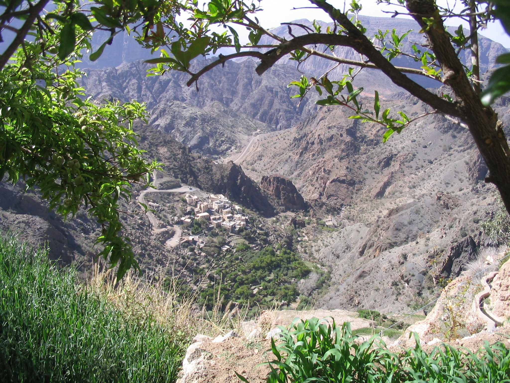
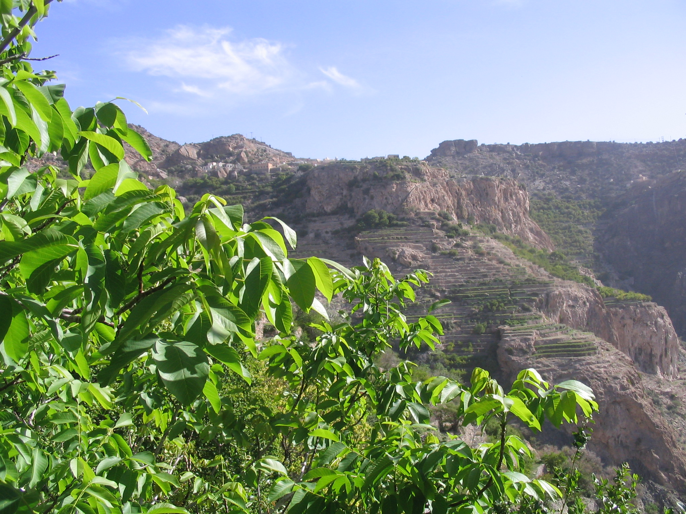
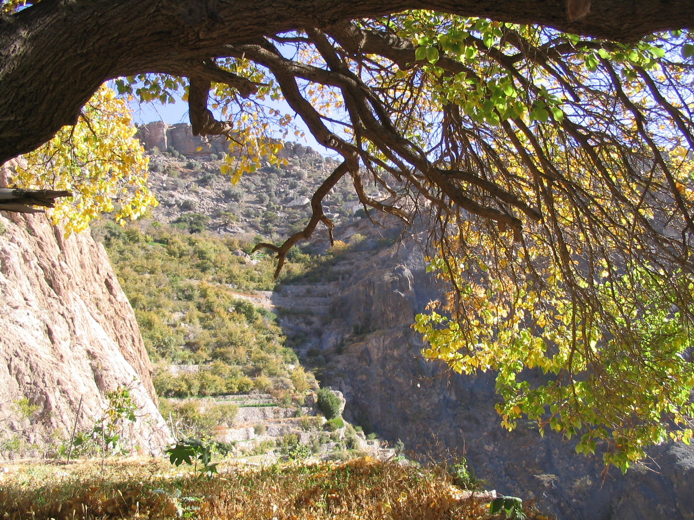
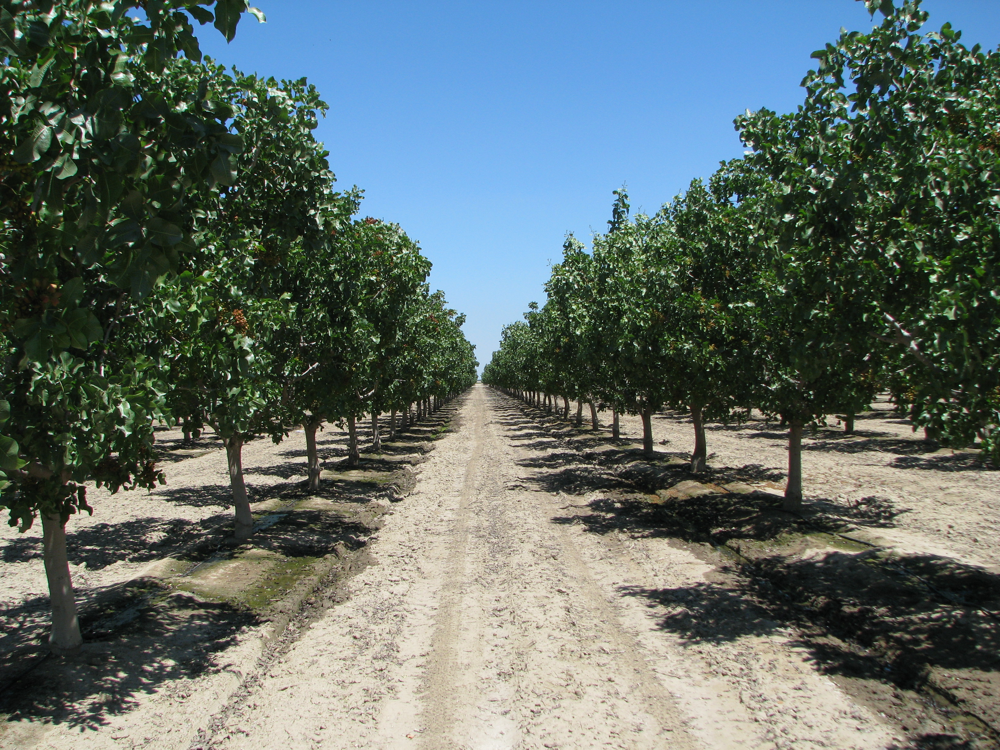
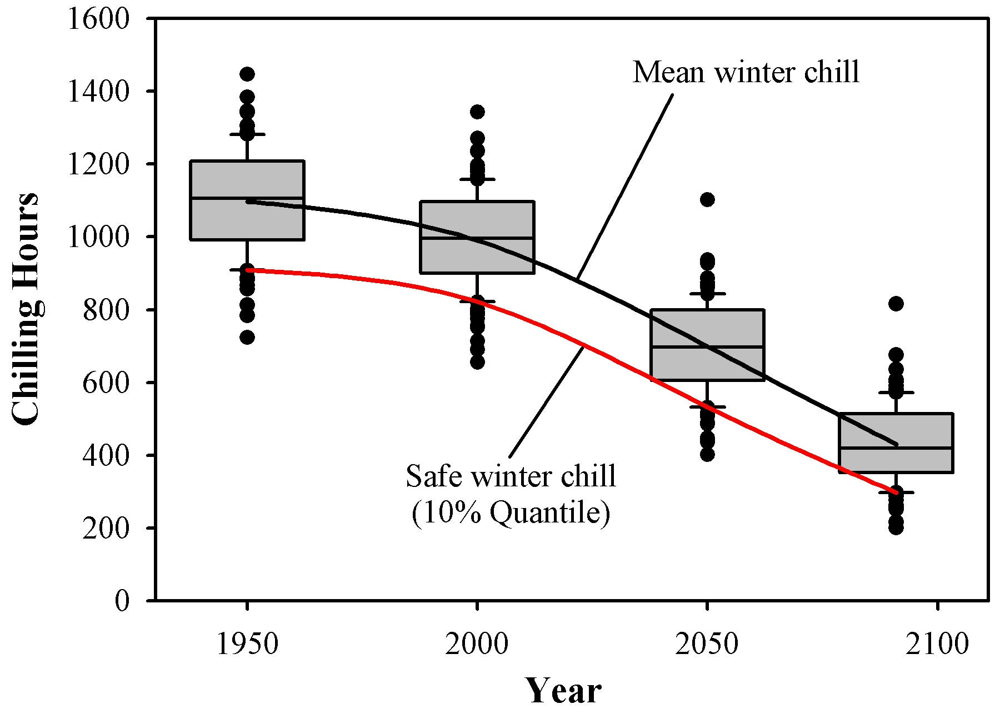
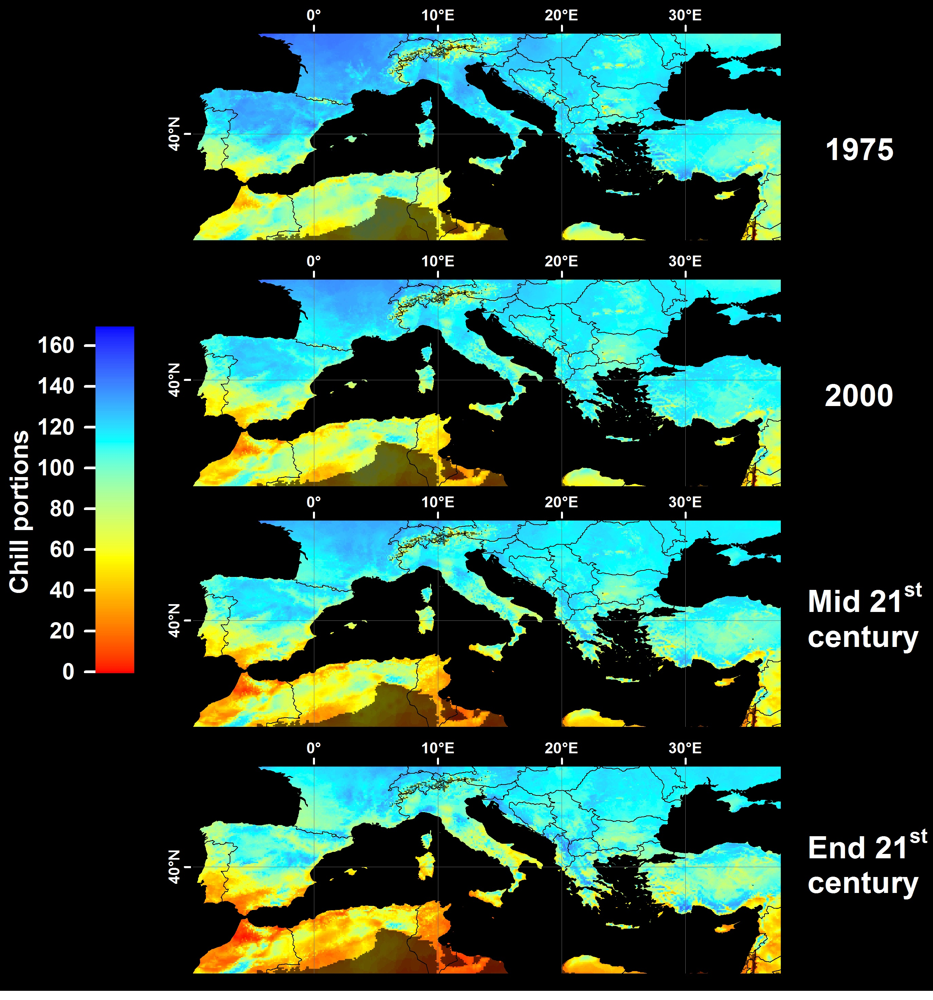

# Winter chill projections

## Learning goals for this lesson {-#goals_analysis_examples}

- Be aware of past studies that have projected climate change impacts on winter chill
- Get a rough idea of how such studies are done
- Get curious about how to do such studies

## Winter chill projections

This lesson will give you an overview of how winter chill can be modeled. More precisely, it will be a little tour of the studies I've done on this in the past. I'll lead you through these studies to help you understand how the methodological pieces of the puzzle fit together. If everything goes according to plan, you should be able to do most of the analyses that are behind these papers after completing this class.

### Winter chill in Oman

As a student at the [University of Kassel](https://www.uni-kassel.de/fb11agrar/fachgebiete-einrichtungen/opats/startseite.html), I had the chance to participate in research projects focusing on mountain oases in the Sultanate of Oman. I also worked on these systems for my PhD, where I first started to get interested in winter chill. This wasn't the original study plan. We were going to calculate nutrient budgets for the oases, and this required measuring the yields of the various fruit trees there. Here's an impression of the oasis orchards:

{width=90%}

This is where you can find these beautiful villages:

```{r, message=FALSE, echo=FALSE}
library(leaflet)
library(dplyr)
```

```{r , fig.cap="Location of the oases of Al Jabal Al Akhdar in the Sultanate of Oman", echo=FALSE}
leaflet() %>%
  addProviderTiles('Esri.WorldImagery') %>% 
  setView(lng=57.66, lat=23.07, zoom=12) %>%
 # addTiles() %>%
  addMarkers(lng=57.66, lat=23.07, popup="Oases of Al Jabal Al Akhdar")

```


Unfortunately, many of the trees in the oasis system we worked in produced no fruits in the years we were there. One of my colleagues, [Jens Gebauer](https://scholar.google.de/citations?user=2UgqSrEAAAAJ&hl=en&oi=ao) (now [Professor of Horticultural Sciences at Rhine-Waal University of Applied Sciences](https://www.hochschule-rhein-waal.de/en/faculties/life-sciences/organisation/professors/prof-dr-habil-jens-gebauer)) suggested that this could have something to do with lack of chilling. This made sense, because most of the trees in these high-altitude oases were not the typical species of the Arabian Peninsula, but temperate trees, such as pomegranates ([*Punica granatum*](https://en.wikipedia.org/wiki/Pomegranate)), walnuts ([*Juglans regia*](https://en.wikipedia.org/wiki/Walnut)) or apricots ([*Prunus armeniaca*](https://en.wikipedia.org/wiki/Apricot)), as you can see here:

{width=33%} {width=33%} {width=33%} 

So, rather than focusing on the nutrient budgets, I started looking into this.

I quickly came across the Chilling Hours model, which I assumed would be a suitable model to quantify chill. I later realized that this model can't really be trusted, especially in such a warm location (we're at almost 2000 m of elevation here, but it's still pretty warm), but I didn't know that then (many people still don't seem to know this, even today).

We had placed temperature loggers in three oases at different levels of elevation, which allowed studying chill accumulation along an elevation gradient. Here's a map of the study area:


The temperature loggers were installed in small sensor shelters, such as the one you see in the image below. Note that this is the one in Masayrat ar Ruwajah, the lowest oasis along the gradient. This is why in this picture, we see the heat-loving date palm ([*Phoenix dactylifera*](https://en.wikipedia.org/wiki/Date_palm)), rather than temperate trees.

{width=50%}

If you want to do a climate change analysis, you can't really just put up a temperature sensor and hope to collect meaningful data in a reasonable period of time. Fortunately for us, an official long-term weather station is located in the vicinity, near the top of the valley. However, this station is roughly 1000 m above the lowest oasis, and it is clear that its readings aren't representative of all locations along the elevation gradient.

Since we had records from the oases, however, we were able to define transfer functions that allowed deriving oasis temperatures from the long-term data. We set these transfer functions up (using PLS regression, which in hindsight wasn't a very good idea) to directly calculate hourly temperatures in the oases from the daily records of the official station at Saiq.

{width=90%} 

Hourly data were needed to calculate the number of Chilling Hours, so this procedure allowed us to calculate winter chill dynamics over the entire time span covered by the official weather station:

{width=90%} 

We submitted a manuscript on this analysis to the journal [Climatic Change](https://www.springer.com/journal/10584?gclid=EAIaIQobChMItKTqpKOF7AIVhZSyCh2taQD4EAAYASAAEgLRIfD_BwE) (where I now have the honor of serving as a [Deputy Editor](https://www.springer.com/journal/10584/editors)). The reviewers there generally liked the study, but they requested that we add future climate scenarios. This is when I first came across a weather generator. Weather generators are tools that can produce random draws of plausible weather, based on observed weather for a particular location.

So we fed such a weather generator (in this case the [LARS-WG weather generator](https://sites.google.com/view/lars-wg/) maintained by [Mikhail Semenov](https://scholar.google.com/citations?user=FDj5OJMAAAAJ&hl=en)) with the data we had for the highest-elevation oasis and told it to generate plausible weather for a number of years for us. We also requested the generator to produce comparable records for possible future scenarios, where temperatures were 1 and 2°C higher than during the historic period. We used our transfer functions on these datasets, and got the following results:

{width=90%} 

This study, which was ultimately accepted by Climatic Change [@luedeling_climate_2009] [*(Link)*](https://link.springer.com/article/10.1007/s10584-009-9581-7), was the beginning of my chill modeling career. Turns our there was still a lot to learn...

### Chill model sensitivity

After finishing my PhD in Kassel, I moved to the [University of California at Davis](https://www.ucdavis.edu/) to work as a Postdoctoral Scholar (I had already done an [MSc in International Agricultural Development](https://iad.ucdavis.edu/) there, and I wrote a grant proposal with [Prof. Minghua Zhang](http://agis.ucdavis.edu/people/minghua_zhang/index.html), whose lab I had been working in then). The new project was on projecting climate change impacts on winter chill in the Central Valley, one of the world's most productive regions for temperate fruit trees.

The first thing I noticed is that the choice of chill model matters - a lot! I had noticed that there are different models to quantify winter chill, but - like many modelers - I decided to go with the one that seemed easiest to handle. This may have been unavoidable at the time, because I had zero programming skills, but this is really not how we should choose models! We'll see a bit more evidence of what errors can result from this later.

After I arrived in California, one of the first things I did was disappear into the library for quite some time to read everything I could find on winter chill. What I found made it pretty clear that model choice was worth looking into. So I used the methodological knowledge I had gained in Oman, created a bunch of temperature scenarios for multiple locations and calculated how chill accumulation was likely to change in the future, according to multiple chill models.

I looked at what changes the various models predicted for the same locations and the same future scenarios. Here are the locations I looked at:

{width=90%} 

Note that 'Hollister', a word many people like to display on their clothes in this age we have the privilege of living in, is actually a place in California where people grow walnuts.

Interestingly, the chill projection results varied considerably across the four models I looked at:

{width=90%} 

In this figure, the past distribution of winter chill is shown on the left, and estimates for 2000 on the second panel. The remaining three panels show three scenarios for 2050. All data are normalized by the median of the 1950 distribution. You can see that especially by 2050, the models differ strongly in the extent of chill losses they project. Since all models are trying to describe the same thing, this is a strong indication that not all models can be right! This study appeared in Agriculture, Ecosystems and Environment [@luedeling_sensitivity_2009] [*(Link)*](https://www.sciencedirect.com/science/article/abs/pii/S0167880909001248). I got some welcome help from my brother, who was able to program a little tool to implement the Dynamic Model.

Based on the literature, as well as on another study [@luedeling2009validation] [*(Link)*](https://www.sciencedirect.com/science/article/pii/S0168192309001580) that I don't want to go into here, I concluded that the Dynamic Model was the most reliable one. So this is the model that will be used for the most part in this course.

By the time I did this study, I began to realize that I was running into a few major problems:

- The model that appeared most reliable - the Dynamic Model - was complicated, and I could only calculate Chill Portions (the unit of this model) with a decades-old Excel sheet [@ExcelDM]. This wasn't satisfying.

- Going through the various data processing steps that were needed to produce credible temperature scenarios was cumbersome and error-prone - and boring.

- I was going to have to learn programming...

### Winter chill in California

The main objective of my stay in California was to produce a winter chill projection for California's fruit and nut growing region - the Central Valley. Here's an impression of what some orchards there look like:

{width=45%} {width=45%} 

California has a fairly dense [network of weather stations](https://cimis.water.ca.gov/), and I wanted to use records from all of them. And for all of these 100+ stations, I wanted multiple climate scenarios (20 or so). This was going to take a long time! The only way to deal with this was to automate most of the process, which made me look into programming. For some reasons that now seem like a major mistake, I decided to automate many steps in JSL, the programming language of a statistics program called JMP. While this wasn't a very smart choice, it mostly worked, and I managed to automate most steps. The only step I still had to do manually was run the weather generator (20+ times for each of 100+ weather stations, so this was still pretty annoying...).

In the end, I managed to produce projections for all stations, which consisted of chill accumulation over 100 plausible winter seasons per scenario, generated with a weather generator. To condense these results into a format that could be shown in a map, I summarized the data by defining a metric called 'Safe Winter Chill'. This is the 10^th^ percentile of the chill distribution, i.e. the amount of chill that is exceeded in 90% of all years. Economically, it may be feasible to grow a tree cultivar that requires this much chill. Here's an illustration of the Safe Winter Chill metric:

{width=90%} 

I also figured out a way to spatially interpolate the station results. We'll get to this later, but here's one of the maps that resulted from this:

{width=90%} 

This analysis appeared in the journal PLOS ONE [@luedeling_climatic_2009] [*(Link)*](https://journals.plos.org/plosone/article?id=10.1371/journal.pone.0006166) .

### Winter chill ratios

Having figured out how to automate processing steps (in that JSL language), I could move on to greater numbers of stations. The goal was to produce a chill projection for the whole planet. I identified a good data source for setting this up in the Global Summary of the Day database (we'll get back to this later). This had useful data for several thousand weather stations (and thousands more of not-so-useful stations, which had to be identified and filtered out). Especially with my fairly poor programming skills, this was a huge endeavor. At some point, the data were being processed on 6 computers, which were running day and night for several weeks. Quite likely, this was not because the analyses were so complex, but because I set things up poorly... Anyway, eventually I managed to process data for about 5000 globally distributed weather stations, for which I calculated multiple chill metrics.

This provided an opportunity to compare chill models again. So I calculated, for each weather station in my dataset, the ratio between various chill metrics. Had these ratios been largely constant all over the planet (e.g. one Chill Portion always corresponds to 10 Chilling Hours), we would have been faily safe using any of the chill models. Unfortunately, this wasn't the case, with enormous variation in chill metric ratios around the world.

{width=90%} 

This study got published in the International Journal of Biometeorology [@luedeling_global_2011] [*(Link)*](https://link.springer.com/article/10.1007/s00484-010-0352-y).

### A global projection of future winter chill

Based on the same analysis procedures, we were also able to produce a global projection of the likely impacts of climate change on winter chill:

{width=90%} 

This study was published in PLOS ONE [@luedeling2011climate] [*(Link)*](https://journals.plos.org/plosone/article?id=10.1371/journal.pone.0020155).

Especially in the areas shown in red and orange in the lower two maps, fruit and nut production may be quite heavily impacted by declining winter chill. With such dramatic chill losses, it seems unlikely that growers will remain able to grow the tree cultivars they currently rely on. In terms of world regions, the Mediterranean region may be hit particularly hard.

{width=90%} 

This is one of the reasons why we started working with partners in this region, as well as other countries with similar climatic settings (e.g. South Africa, Chile).

### Winter chill in Germany

Germany is not highlighed as particularly vulnerable to chill losses. Analyzing historic chilling trends between 1950, we were able to confirm this impression [@luedeling_auswirkungen_2009] [*(Link)*](https://link.springer.com/article/10.1007/s10341-009-0085-4).

{width=90%} 

The reason for this lack of major changes is that current winter temperatures in Germany are right in the middle of what appears to be the most effective temperature range for chill accumulation. A little warmer or a little colder therefore doesn't make much of a difference.

### Winter chill in Tunisia

Prospects are quite different for orchards in Tunisia. Here we're close to the warmest margin of the production range for many fruit and nut tree species. We published an assessment of past and future trends in winter chill for an orchard in Central Tunisia in 2018, about 7 years after all the other projection studies shown above. This long break was partly because my day job at the time involved [agroforestry](https://www.worldagroforestry.org/), [decision analysis](https://www.worldagroforestry.org/sites/default/files/Publications/PDFS/JA16154.pdf) (you can learn about this in our summer term module [Decision Analysis and Forecasting in Agriculture](https://agtools.app/decision_analysis/)) and a few other things, but not winter chill. More importantly, however, it took me quite a while to overcome a major challenge of climate change analysis - where to find appropriate information on future climates.

Difficulties in finding future climate data may seem surprising, given the ubiquity of climate change research. In fact, finding data is not difficult, but data that can easily be used for the purposes of chill modeling (of the kind I like doing) still wasn't readily available. For some reason, most future climate projections were mostly disseminated as spatial grids covering various extents. Some datasets were only within my reach as raster files covering the whole planet. At even a moderate spatial resolution of 2.5 arcminutes, each of these grids had a size of about 170 MB. This may not sound like much, but consider that for each climate scenario, we need 12 grids, for the mean daily minimum temperature of each month, and another 12 for the maximum temperature (for some weather generators, we need another 12 for rainfall). Consider further that for state-of-the-art climate change scenarios, we should investigate multiple future climate 'pathways'. In my earlier studies, we used the so-called SRES emissions scenarios (named after the IPCC **S**pecial **R**eport on **E**missions **S**cenarios), usually focusing on the three most commonly used scenarios B2, A1B and A2. So now we're already at 72 grids (assuming we don't need rainfall).

Since we still have incomplete understanding on how the global climate system works, many research groups have developed so-called 'General Circulation Models' (GCMs; many people also use an alternative long form: 'Global Climate Models'), all of which differ slightly in their projections. We currently have no way of deciding which of these models, if any, is right, so the climate science community decided that we should produce *ensemble* forecasts, i.e. project changes using outputs from all the available models (that are considered credible). The dataset I typically worked with included 20 GCMs. To make matters worse, I typically wanted to project gradual changes over time by including multiple years in an analysis, e.g. the 2020s, the 2050s and the 2080s. You can probably see where this is headed. When we multiply all these numbers, we realize that we need 4320 grids. The disk space required to store these data (in uncompressed form) is more than 700 GB. This is not impossible to find, but processing this amount of data is cumbersome and time-consuming. Still, I actually managed to set up a data processing structure for this and download all the data to an external hard drive.

Soon after I had set up this structure, the IPCC came up with a new report that introduced the 'Representative Concentration Pathways' (RCPs) to replace the SRES scenarios. For a few years, it was still ok to work with the old scenarios, but eventually it got harder and harder to get such studies through the peer-review process. The scenarios simply weren't up to date any more. However, I was not excited by the prospect of downloading another massive dataset and starting all over again... What made this particularly difficult for me was that I was based in Kenya then, with fairly poor data transfer rates.

It was only until I started working with colleagues in Tunisia, specifically with [Haifa Benmoussa](https://scholar.google.de/citations?hl=de&user=DdV9jsAAAAAJ), who was doing her PhD at the University of Tunis, but collaborated intensively with me on most of her dissertation chapters. In some of these chapters, we discovered that tree crops grown in Central Tunisia, specifically almonds [@benmoussa2017chilling] [*(Link)*](https://www.sciencedirect.com/science/article/pii/S0168192317300734) and pistachios [@benmoussa_performance_2017] [*(Link)*](https://www.sciencedirect.com/science/article/abs/pii/S0098847217301119) were highly vulnerable to the impacts of climate change. In order to forecast the future prospects for pistachios and almonds in Tunisia, we needed climate scenarios.

It turned out that in the meantime, some climate scientists had produced a future climate database specifically for Africa - AFRICLIM [@platts2015africlim], which contained exactly what we needed. Since this database didn't include the whole planet, it was much easier to download and store, and processing the data was much less cumbersome. So I added functions to `chillR` to implement procedures to sample from the AFRICLIM grids and produce *ensembles* of climate scenarios. I also started putting together a framework to automatically produce the kind of plots that are shown below. Here's the plot we produced for this paper [@benmoussa2018climate] [*(Link)*](https://link.springer.com/article/10.1007/s00484-018-1628-x):

{width=90%} 

If all goes well, you'll be able to produce such a figure by the end of the semester. This figure contains a number of interesting features that you'll learn about in this module. The plots on the left indicate the historic development of chill accumulation at this location. In this, the actually observed values are indicated by red dots. In addition to these dots, the plots also contain boxplots that describe the typical chill distribution at a particular point in time. These were generated with a weather generator that is accessed by `chillR`. This weather generator is calibrated with observed weather data and provided with an estimate of how various climate metrics differed from the long-term average climate in 1975, 2000 and 2015. With this information, we can generate a large number of artificial yearly weather records that might have occurred at these points in time.

The weather generator was also used to produce future scenarios. Also here, the tool was calibrated with observed weather data, but the scenarios that were added were not derived from the historic record, but extracted from the AFRICLIM database.

Now let's look at what this figure shows, because that it quite alarming. Usually, in a climate change projection, we would now start comparing forecasts for different scenarios, which are often not entirely consistent. Here, we don't have such a problem. It seems very clear that there is not a single future scenario in this analysis, where cultivation of pistachios or high-chill almonds remains viable! This conclusion is based on the assumption that our understanding of how to quantify winter chill isn't totally wrong. It is supported by recent observations in Tunisia, where, after the particularly warm winter of 2015/16, many pistachio trees barely developed any flowers, which resulted in virtually complete crop failure:

{width=90%} 

### Winter chill in Chile

AFRICLIM solved the future climate data problem for locations in Africa. However, this dataset fell short of what was needed in order to add climate change projection capability to `chillR`. First, it was unsatisfying that this dataset only covered Africa. Second, users who are only interested in data for a single location, which is what `chillR` is designed for, shouldn't have to download a large dataset, before they can run analyses. What was needed was a tool that could quickly access single-location data for weather stations anywhere on the planet.

One of my early sources of climate information was a tool called 'ClimateWizard', put together by my friend and collaborator [Evan Girvetz](https://scholar.google.de/citations?user=Yh2sQY4AAAAJ&hl=de), who now works for the International Centre for Tropical Agriculture (CIAT) in Nairobi. This tool initially only made gridded data available, but already for the California study cited above [@luedeling_climatic_2009] [*(Link)*](https://journals.plos.org/plosone/article?id=10.1371/journal.pone.0006166), Evan had written a script to quickly extract information for single locations, which is really all that's needed for single-site studies. Eventually, at CIAT, he made this function available to a wider audience through an application programming interface (API), to allow accessing outputs from 15 climate models for state-of-the-art RCP scenarios.

This tool allowed us, in this case led by [Eduardo Fernández](https://scholar.google.de/citations?hl=de&user=ibSma_AAAAAJ), to expand our geographic reach into South America. Focusing on nine locations throughout Chile, Eduardo analyzed past and future chill development across a wide climatic gradient [@fernandez2020prospects] [*(Link)*](https://link.springer.com/article/10.1007/s10584-019-02608-1).

{width=90%} 

{width=90%} 

Apparently, Eduardo didn't like my plot design, so he redesigned it using the `ggplot2` package, a powerful plotting package for R. One of the things that we can see here is that with data for many sites, things get a bit too complex to easily grasp. So Eduardo thought of a creative way to extract some key information for each scenario and display it as a heat map:

{width=90%} 

We see here clearly the north-south gradient in available chill, as well as (less clearly) the tendency for lower chill towards the right panels, especially towards the lower right corner.

### Chill projection for Patagonia

Some locations on our planet may become more hospitable for agriculture, as the climate changes. We used our analysis framework to look into the climatic suitability for fruit and nut trees near agriculture's southern frontier - in Patagonia, in southern Argentina [@delclimate] [*(Link)*](https://rmets.onlinelibrary.wiley.com/doi/pdf/10.1002/joc.6649).

{width=90%} 

We got weather station records for all the locations shown in the map, used them to calibrate our weather generator and downloaded climate projections from the ClimateWizard database. This then allowed making past and future temperature scenarios for all stations and to compute winter chill and a few other agroclimatic metrics.

Results of the winter chill calculation were not so interesting here, with very little change projected.

{width=90%} 

In fact, climate change may have a positive effect on land suitability for fruit trees, because more summer heat will be available:

{width=90%} 

A further beneficial development is a likely reduction in the number of frost hours:

{width=90%} 

This may all not look very spectacular, but it seems quite likely to me that the small changes we're seeing will promote many locations from a climate that is really too cool for agriculture, especially for fruit trees, to a fairly optimal situation. For a change, some possibly good news related to climate change (though also this will likely come with negative implications for natural ecosystems and possibly other agricultural systems).

### Chill model comparison

Eduardo Fernandez recently used our climate change analysis framework to compare chill models [@fernandez2020importance] [*(Link)*](https://www.sciencedirect.com/science/article/abs/pii/S1161030120301106), greatly expanding on  my earlier chill model comparisons [@luedeling_global_2011] [*(Link)*](https://link.springer.com/article/10.1007/s00484-010-0352-y). He assembled a collection of 13 approaches to quantify chill accumulation from the literature and applied the models he found to datasets from a number of locations in Germany, Tunisia and Chile (the countries involved in our PASIT project). Here's a map of the locations:

{width=90%} 

The expectation was that the models would differ strongly in the extent of changes they predicted. This expectation was not disappointed:

{width=90%} 

This figure shows the changes predicted by the 13 models (y-axes) across various sites and climate scenarios. Note that Eduardo already did a lot of data compression here, categorizing the various climate models into three categories (warm, moderate and cool), and summarizing across all models in each of the classes. What we see here should be pretty disturbing for everyone who (like me, a decade before) simply chooses the most convenient model for predicting something. This analysis reveals massive differences across the models! This can easily be seen by comparing the color distribution across the rows in each of the panels. A set of equivalent models would have produced the same shade of red or blue for each column of the plots in this figure. The result we obtained is far from that, showing huge differences in model predictions. For locations in Tunisia and Chile, this variation mainly concerns the extent of chill losses, with predictions ranging from rather mild to alarming. For locations in Germany, not even the direction of change is clear, with some models predicting increases, others decreases in available chill.

These results clearly indicate that **model choice matters**! Fortunately, many of these models seem rather arbitrary and can easily be dismissed. Yet there surely is residual uncertainty about which of these models, if any, makes the right calls. This is an active field of research that creative minds can/will make meaningful contributions to in the future.

### Chill projection for all of Tunisia

As mentioned above, we projected climate change impacts on winter chill for an orchard near Sfax in Central Tunisia [@benmoussa2018climate] [*(Link)*](https://link.springer.com/article/10.1007/s00484-018-1628-x). This is, however, not the most interesting region in the country for growing temperate fruit and nut trees. Despite its rather modest size, Tunisia is a climatically diverse country, with mountains and plains, coastal areas and interior deserts. Historic and future chill availability therefore shows considerable variation within the country.

Led by Haifa Benmoussa, we mapped chill accumulation across Tunisia, based on the framework we've already encountered [@benmoussa2020severe] [*(Link)*](https://link.springer.com/article/10.1007/s10584-020-02774-7) This analysis was based on 20 weather station locations across Tunisia and neighboring countries. By now, you probably have a pretty good idea of how we did this analysis - we just applied the analysis framework we developed to each of the 20 locations. In addition to the site-specific analysis we had produced earlier, we were now able to interpolate our results to produce chill maps that track chill availability in Tunisia over the past few decades:


{width=90%} 

You may wonder here how we managed to interpolate the site-specific results into a map that covers the whole country. Well, this is an area that we may still make some improvements in. The current procedure, which is probably not perfect yet, is that we take the site-specific predictions of Safe Winter Chill (remember that's the 10^th^ percentile of the chill distribution derived from the 'replicates' of annual temperature dynamics produced by the weather generator), and interpolate a surface through them (using the Kriging technique). We did the same for the elevations of the locations we modeled chill for. We then fitted a linear model to relate chill accumulation to elevation. Making use of a Digital Elevation Model (DEM), we were able to calculate the difference between the elevation model derived from the weather station elevations and the *true* elevations of each location of the country. Considering that this difference is not yet accounted for by the chill surface that was derived by interpolating chill data for the weather stations, we used the elevation~chill relationship we determined to correct chill predictions.

Was this confusing? Well, there's room for improvement here, and it's pretty clear that the procedure I just described will only work in places with a linear relationship between elevation and chill availability. This seems a fairly reasonable assumption in Tunisia, but it would not work in many cooler locations, such as Germany.

Here's the projection of future chill we produced for Tunisia: 

{width=90%} 

What we see here is pretty concerning. The Dynamic Model, which we used to predict chill here, is considered rather credible, and we're seeing massive decreases in Chill Portions, the units the Dynamic Model uses. This is bad news for most of Tunisia! Note that even in the places where we expect substantial winter chill to remain, farmers will likely have to adapt, because the trees they grow are aligned with the climate of the past. Adaptation strategies may involve transitioning to tree cultivars with low chilling requirements (if such cultivars are available).

### Revisiting chill accumulation in Oman

After a decade of foraging in other parts of the world, let's come back to Oman. I'd long been a bit dissatisfied with the initial work we did there. Note that the first analysis was my first study on chill accumulation. At the time, I did not know about the hazards involved in model choice. I also didn't have proper data on projected future climates then, and the process that converted daily to hourly temperatures was quite a bit less than ideal.

My PhD supervisor and mentor [Prof. Dr. Andreas Bürkert](https://scholar.google.de/citations?user=ZNvcJJ8AAAAJ&hl=de) had pushed me for quite some time to redo the analysis for Oman. With our climate change analysis framework, we could finally do it. Adding some new ideas on how to convert daily into hourly temperatures in a place like the oases of Oman we were interested in (you'll learn about these ideas later in this module), we produced updated assessments of past winter chill and forecasts of future chill for the oases of Al Jabal Al Akhdar. The results appeared once again in Climatic Change [@buerkert2020revisiting] [*(Link)*](https://link.springer.com/article/10.1007/s10584-020-02862-8).

### Future studies?

Now we've reached the present. By now you should have a pretty good overview of the state of the art in chill modeling (or the modeling of climate change impacts on any temperature-related phenomenon). By the end of this module, you should be able to do such analyses yourself. The next steps will be up to you!


## `Exercises` on past chill projections {-#exercises_past_studies}

Please document all results of the following assignments in your `learning logbook`.

1) Sketch out three data access and processing challenges that had to be overcome in order to produce chill projections with state-of-the-art methodology.

2) Outline, in your understanding, the basic steps that are necessary to make such projections.