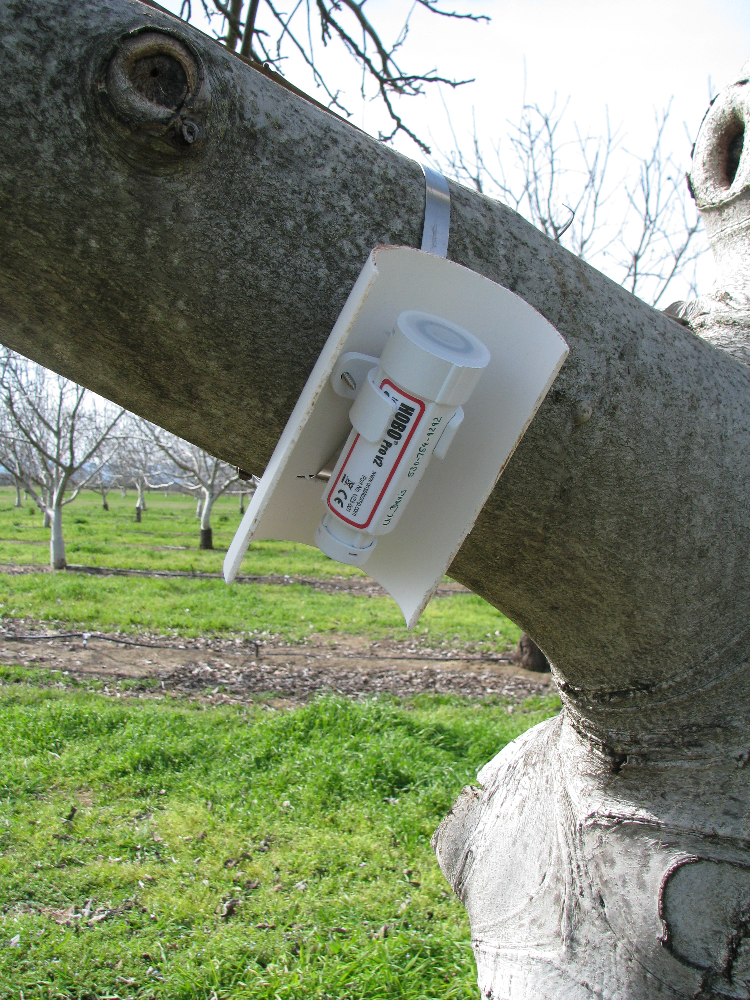
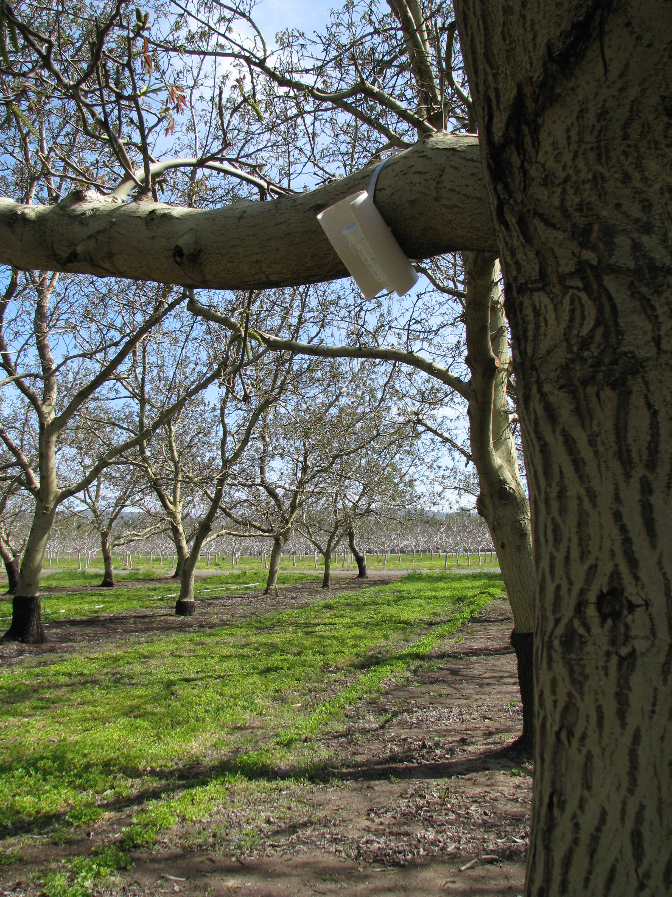

# Manual chill analysis

## Learning goals for this lesson {-#goals_manual_chill_analysis}

- Learn about some basic R operations we need for calculating Chilling Hours
- Be able to calculate Chilling Hours
- Understand what an R function is
- Be able to write your own basic function

## Computing Chilling Hours from hourly temperature data

Basic chill models like the Chilling Hours Model aren't particularly complicated, so it's not so hard to calculate chill manually (at least not if you're familiar with R, or even a spreadsheet program). So we're going to try this here to gain some understanding of what the respective functions in the `chillR` package do.

One important challenge that most people who want to compute Chilling Hours quickly realize is that we need hourly temperature data. Quite often, such data aren't available, and that's already where the problems start. For now, we're going to ignore this problem and work with data that already has an hourly time step. A bit later, we'll talk about ways to make pretty good approximations of hourly temperature data from daily records, for which `chillR` offers a few neat tools.

Let me first say that I always have to swallow a toad when I use Chilling Hours, because I don't think they are very useful. They are, however, the chill model that is most widely known, they are very easy to explain, and they are not hard to calculate. Since at this point we're absolute beginners in chill modeling, let's start there.

First, we have to get data into R. The most obvious way to achieve this is reading a data table into R with the `read.table` or `read.csv` functions. There are also packages that can read in `.xls` or `.xlsx` files.

For this initial example, we won't do this, but work with a sample dataset that comes with `chillR`. The package contains the dataset `Winters_hours_gaps`, which was recorded in a walnut orchard near Winters, California, in 2008. You can get some impressions of the setting here:

{width=33%} {width=33%} {width=33%}

These three pictures were taken between March and May of 2008. Note how the light conditions change over time. This impacts the daily temperature dynamics, which we'll talk about in one of the next chapters

To gain access to the `Winters_hours_gaps` dataset, and to all other functionality in the `chillR` package, we have to first install and load `chillR`.

Note that in the call below, the `install.packages` command is 'commented out' by the hashtag (#). This means that the respective line isn't evaluated. If you haven't installed 'chillR' yet, you'll have to run this line without the #. I'm also loading a couple of additional packages (`knitr`, `pander`, `kableExtra`) that are needed for making the website you're looking at.

```{r load_chillR, warning=FALSE}
#install.packages("chillR")
library(chillR)
library(knitr)
library(pander)
library(kableExtra)
```

Especially if you're a beginner in `R` or with `chillR`, but probably also very often later, you may want more information about the functionality you just loaded. You can get more information with the `?` command. For more information about a package, you can type something like `?"chillR-package"` (note the quotation  marks). For a function within a loaded package (here the `chilling` function), simply type `?chilling`. To find information about a function across all packages that are installed (but not necessarily loaded), you can use a double question mark: `??chilling`.

Since the `Winters_hours_gaps` dataset comes with `chillR`, we can now display it by running `Winters_Hours_gaps`.

For this website, I'll use a slightly more complex code to ensure that the table is properly formatted (using the `kable` format, which you don't need in R, but which makes the markdown output prettier - you'll learn later what this means).

```{r show_Winters}
kable(Winters_hours_gaps[1:10,])  %>%
  kable_styling("striped", position = "left",font_size = 10)
```

The dataset contains a column that we don't need (`Temps_gaps`, which I added to demonstrate the use of a `chillR` function that can fill such gaps), so I'm creating a new dataset (`hourtemps`) that only contains the columns we want.

```{r show_Winters_no_gaps}
hourtemps <- Winters_hours_gaps[,
                                c("Year",
                                  "Month",
                                  "Day",
                                  "Hour",
                                  "Temp")]
```

What we get now is the standard format of an hourly `chillR` temperature record - with separate columns for `Year`, `Month`, `Day`, `Hour` and `Temp`. The last column contains hourly temperatures (without gaps), which we can use to calculate Chilling Hours.

The data format of this dataset is called `data.frame`. This is a structure with multiple columns and rows. We can access information in this `hourtemps` `data.frame` by referring to it as `hourtemps[row,column]`. Here `row` can be a number, a range of numbers (e.g. `c(1,2,4)`, `1:5`), or even a name, if you're using the option to assign names to rows (we're not doing that here). `column` is the same for the columns, except that for this we are using names (e.g. `Year`, `Temp`). If you want all rows (columns), leave the column (row) argument blank. To refer to a column, you can also add the name directly after the data.frame name, separated by a `$` sign.

```{r check_out_data.frame}
hourtemps[3, ]
hourtemps[3, "Temp"]
hourtemps$Temp[1:5]
hourtemps[1:5, ]
```

To assign new values to R objects, you can use the `<-` sign. You already saw an example of this above, where the `hourtemps` `data.frame` was defined. You can also use such an assignment to create a new column in a `data.frame`. To do this, you just assign new values to a column with the name of your choice `hourtemps[,"myColumn"]<-NA`. `NA` means 'not available'. It's R's way of saying there's no data here. But let's directly jump to a more useful example that will set us on the path to calculating Chilling Hours.

We've already talked about Chilling Hours, but here's a reminder of what they are: Every hour with temperatures above (and including) 0°C and below (and including) 7.2°C is considered a Chilling Hour.

So what we have to do is check for every hour whether temperatures fall in this range. Such checks can be implemented in R with fairly simple comparison commands (`<`, `<=`, `==`, `=>` and `>`). These can be applied to single numbers, or to so-called `vectors`, which are strings of numbers (such as the ones created by the `c()` command - we already used this above). We can combine multiple such comparisons with the `&` command.

```{r comparisons,results='as.is'}
1 == 2
1 == 1
c(1, 2, 3) > 2

a <- 1
b <- 2
c <- 3
c(a, b, c) >= 2
c(a, b, c) >= 2 & c(a, b, c) < 3

```

So now we want to check if temperatures in a given hour are within the range considered to be effective for chill accumulation by the Chilling Hours Model. We then want to assign this result to a new column `Chilling_Hour`.

```{r manual_chilling_weight}

hourtemps[, "Chilling_Hour"] <-
  hourtemps$Temp >= 0 & hourtemps$Temp <= 7.2

hourtemps[13:20, ]
```

I'm showing you here the rows 13-20 of the dataset, because temperatures only then reached the interesting range. The `Chilling_Hour` column now reads `FALSE` and `TRUE`, but these values are equivalent to `0` and `1`, and we can calculate with them. It's now easy to add up the Chilling Hours of a particular period, which we can do with the `sum` command.

```{r summing_CH}
sum(hourtemps$Chilling_Hour[13:20])
```
So between the 13^th^ and 20^th^ hour, we had 4 Chilling Hours. With a slightly more complex command, we can calculate chill between actual dates. We'll use the `which` command to identify the hours in the dataset that correspond to the date we're interested in.
```{r summing_CH_dates}

Start_Date <- which(hourtemps$Year == 2008 &
                      hourtemps$Month == 10 &
                      hourtemps$Day == 1 &
                      hourtemps$Hour == 12)
End_Date <- which(hourtemps$Year == 2008 &
                    hourtemps$Month == 10 &
                    hourtemps$Day == 31 &
                    hourtemps$Hour == 12)

sum(hourtemps$Chilling_Hour[Start_Date:End_Date])

```
So in October of 2008, Winters experienced 28 Chilling Hours.

## Our first chill function

The code for calculating Chilling Hours wasn't very complex, and we could easily program it again next time we want to do this. However, this is the simplest chill model, and it's not very good. The other models are more complicated, and we would probably not want to code them again and again. In such situations programmers use functions. A function is a tool that automates a particular procedure. Even up to here, we've already encountered a few functions, including `read.csv()`, `c()` and `sum()`. Now we make one ourselves.

A function consists of a name, some arguments that are passed to the function, and some code that should be executed. We can define is as `OurFunctionName <- function(argument1, argument2, ...) {ourCode}`. All the arguments can be used in the function. What's returned is either the last object that's mentioned in the function code or some content specified by the `return()` function. Here's an example of this for the Chilling Hours calculation:

```{r CH_function}
CH<-function(hourtemps)
{
  hourtemps[, "Chilling_Hour"] <-
    hourtemps$Temp >= 0 & hourtemps$Temp <= 7.2
  return(hourtemps)
}
```

Now we have a function that adds a column called `Chilling_Hour` to our dataframe, which indicates whether an hour is a Chilling Hour or not. Here's how we can use this:

```{r apply_CH}
CH(hourtemps)[13:20, ]  # again restricted to rows 13-20,
                       # because we don't want to see the whole output here.
```

We can also make more complex functions, e.g. to calculate the number of Chilling Hours between two dates, which we can specify in the `YEARMODA` format (i.e. year, month and day, combined in one number).

```{r calculate_CH}
sum_CH <- function(hourtemps,
                   Start_YEARMODA,
                   End_YEARMODA)
{
  Start_Year <- trunc(Start_YEARMODA / 10000) # "trunc" removes all decimals
  Start_Month <-
    trunc((Start_YEARMODA - Start_Year*10000) / 100)
  Start_Day <- 
    Start_YEARMODA - Start_Year * 10000 - Start_Month * 100
  Start_Hour <- 12 # This could also be flexible, but let's skip this for now
  End_Year <- trunc(End_YEARMODA / 10000)
  End_Month <- trunc((End_YEARMODA - End_Year * 10000) / 100)
  End_Day <- End_YEARMODA - End_Year * 10000 - End_Month * 100
  End_Hour <- 12 # This could also be flexible, but let's skip this for now

  Start_Date <- which(hourtemps$Year == Start_Year &
                        hourtemps$Month == Start_Month &
                        hourtemps$Day == Start_Day &
                        hourtemps$Hour == Start_Hour)
  End_Date <- which(hourtemps$Year == End_Year &
                    hourtemps$Month == End_Month &
                    hourtemps$Day == End_Day &
                    hourtemps$Hour == End_Hour)

  Chill_hours <- CH(hourtemps)
  
  return(sum(Chill_hours$Chilling_Hour[Start_Date:End_Date]))

}

```
This function now includes the pretty annoying conversion between YEARMODA format and the separate columns that are required by `chillR`. This is stuff you wouldn't want to program again and again... You see that we're already making use of our `CH()` function here, to abbreviate the check for whether temperatures during a particular hour are in the 'chilling range'.

With one call, we can now compute chill accumulation between two dates. Note that the dataset only goes from 3^rd^ March to 11^th^ November 2008, so use of any dates outside that range will generate an error message. If we want to make a more user-friendly function, we'd now add checks for date validity etc. Maybe we'll do such things later. Here's how we can now calculate Chilling Hours between two dates:

```{r calc_CH_example}
sum_CH(hourtemps, 20080401, 20081011)
```

This is basically how functions work, and we'll encounter lots of this throughout this course. `chillR` contains many small functions that do specific things. These are then used by other functions to achieve bigger and better things, and in the end we can manage to automatically do some pretty complex analyses.

## `Exercises` on basic chill modeling {-#exercises_manual_chill_analysis}

Please document all results of the following assignments in your `learning logbook`.

1) Write a basic function that calculates warm hours (>25°C)
2) Apply this function to the Winters_hours_gaps dataset
3) Extend this function, so that it can take start and end dates as inputs and sums up warm hours between these dates

