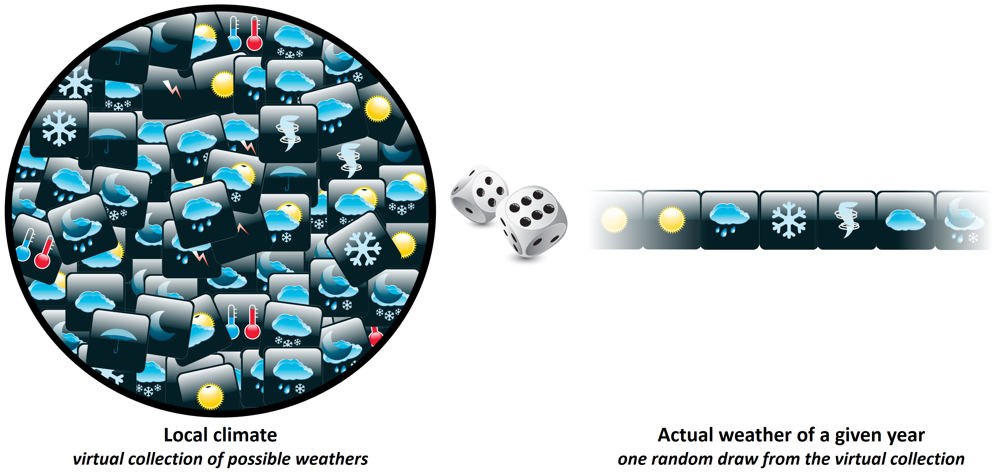

# Generating temperature scenarios

## Learning goals for this lesson {-#goals_temperature_scenarios}

- Understand what a weather generator is, (roughly) how it works and why it is useful for planning
- Learn how to run the `temperature_generation` function included in `chillR`
- Be able to produce chill profiles for a place of interest using histograms and cumulative distributions
- Understand what Safe Winter Chill is and be able to calculate it

```{r temp_gen_set_up, echo=FALSE}
library(chillR)
library(ggplot2)
library(tidyverse)

Temperatures<-read.csv("data/generated_temperatures_example_1.csv")
Temperatures[,"Date"]<-as.Date(ISOdate(2000, Temperatures$Month, Temperatures$Day))

chill_comparison_full_seasons<-read.csv("data/chill_comparison_full_seasons.csv")

```


## Chill scenarios

A big part of the rationale for what we've been doing so far has been to develop a feeling of the chill availability (or other agroclimatic conditions) at a given site. This information is crucial for orchard managers selecting tree species and cultivars for their orchards. Looking at the historic record has already given us a lot of useful information, but this isn't yet exactly the information that a grower making planting decisions needs. What is really needed is a site-specific agroclimatic characterization that provides an impression of the range of conditions that we can reasonably expect at this location. In other words, we may want to have information on how likely it is for the orchard to experience certain levels of chill, heat or whatever other metric we are interested in.

## Risk assessment in orchard planning

Since trees live and are (hopefully) productive for many years, they experience many different temperature dynamics during their productive lifetime. For optimal production, trees should fulfill their climatic needs in all of these years. This is why, when we select trees for planting, we need information on the plausible range of 'weathers' we can expect. Based on this, we would be able to select trees that safely fulfill their chilling requirements in all plausible weather situations, or we could choose trees that strike a balance between early flowering and the risk of spring frost. All such decisions require information on how likely it is for our orchard to experience certain conditions.

The plausible range of 'weathers' we can expect is defined by the local climate, which is the long-term average of the annually observed weather. We can interpret this 'climate' as a virtual collection of all possible weather situations for a given location, from which we receive one random draw each year.



For planning purposes, it would be much more useful to know this virtual distribution of possible 'weathers' than just looking at the random samples that happened to be drawn. So far, we've only been able to get these samples - that was the historic analysis of observed chill. In this lesson, we'll try to get to the actual climate, and from there to ways to use this knowledge for producing temperature profiles for locations of interest that facilitate orchard planning.

## Weather generators

Our best source of information for characterizing the climate of a given location consists in long-term weather records collected there. Based on such records, we can easily calculate means of monthly temperatures, rainfall extremes, the frequency of frost events and various other metrics. Of course there are varying levels of detail we can choose in characterizing the local climate, and a certain level of sophistication is needed if we want to produce realistic weather records.

Weather generators vary widely in the way they characterize climatic settings. I haven't really reviewed this much, but there would clearly be benefits to understanding in more detail how exactly these weather generators work, in order to make a good decision on which generator to choose. For the purposes of `chillR`, we depend on the weather generator of choice being implemented in R and being compatible with `chillR`'s overall structure. So far, I've only identified one weather generator that meets these requirements, from the [RMAWGEN](https://cran.r-project.org/web/packages/RMAWGEN/index.html) package, so I haven't had the luxury or being able to choose. However, I looked at other weather generators before moving the whole framework to R and used the [LARS-WG](https://sites.google.com/view/lars-wg/) tool in some of my earlier analyses [@luedeling_global_2011; @luedeling2011climate] ([*Link*](http://link.springer.com/10.1007/s00484-010-0352-y) and [*Link*](https://journals.plos.org/plosone/article?id=10.1371/journal.pone.0020155)). That generator uses both temperature and rainfall data, identifying the typical length of dry and wet spells and producing distinct temperature profiles for each of these weather situations. The tool `chillR` currently uses doesn't do that - it doesn't even need precipitation data - but it also seems to be doing a good job. Having said this, it is somewhat difficult to assess the performance of these tools, so there is probably still room for improvement here.

## Weather generation in `chillR`

So `chillR` uses the [RMAWGEN](https://cran.r-project.org/web/packages/RMAWGEN/index.html) weather generator. This is the only R-based weather generator I've found so far, so this is what we'll use. It seems pretty reliable, and, after an initial struggle to set it up, I haven't encountered any major problems.

I should first mention that `chillR` currently can't generate weather in a comprehensive way, but only focuses on temperature. Expanding the capabilities here is a development need (which [Lars Caspersen](http://inresgb-lehre.iaas.uni-bonn.de/author/lars-caspersen/) has started addressing)!

The `temperature_generation` function in `chillR` first needs to be calibrated with observed weather data, in our case long-term temperature data provided in the chillR format. Based on this, it internally calculates parameters that characterize the local climate. These are then used to simulate a user-specified number or years of synthetic temperature data.

As usual, we'll start working with our Klein-Altendorf dataset (`KA_weather`). Besides the temperature data, for which all years have to be complete, the `temperature_generation` function needs a bit of additional information:

- years: a vector specifying the years within the observed record that we want to use for climate characterization
- sim_years: the years we want to simulate. Note that we're not really simulating weather for the specific years we indicate here - this is just for the way years are labeled in the output dataset
- there are a few optional elements, but I only want to highlight one here: `temperature_scenario`. We'll need this later. For now, we use the default value, which consists of a lot of zeros. In the first example, this will just generate a warning message - you'll learn later what this is about.

So here's how to use the weather generator (just the first line of the code chunk), and to get an impression of how the generated data compare with the observed records.

```{r weather_generator_set_up, eval=FALSE}
Temp <- KA_weather %>% 
  temperature_generation(years=c(1998,2005),
                         sim_years = c(2001,2100))
    

Temperatures <- KA_weather %>% filter(Year %in% 1998:2005) %>%
  cbind(Data_source="observed") %>%
  rbind(
    Temp[[1]] %>% select(c(Year,Month,Day,Tmin,Tmax)) %>% 
      cbind(Data_source="simulated")
    ) %>%
  mutate(Date=as.Date(ISOdate(2000,Month,Day)))


```

```{r weather_generator_set_up_plot, message = FALSE}
ggplot(data=Temperatures,
       aes(Date,Tmin)) +
  geom_smooth(aes(colour = factor(Year))) +
  facet_wrap(vars(Data_source)) +
  theme_bw(base_size = 20) +
  theme(legend.position = "none") +
  scale_x_date(date_labels = "%b")

ggplot(data=Temperatures,
       aes(Date,Tmax)) +
  geom_smooth(aes(colour = factor(Year))) +
  facet_wrap(vars(Data_source)) +
  theme_bw(base_size = 20) +
  theme(legend.position = "none") +
  scale_x_date(date_labels = "%b")

```

Note that the previous plot was produced with the `geom_smooth` function of ggplot, rather than `geom_line`. This removed much of the noise in the dataset, which would otherwise have made this figure hard to read.

As we can see here, the overall temperature dynamics were represented quite well, though it is certainly possible that some nuances of the local weather were missed. In the simulated dataset, we now have 100 years of data, even though we only used 8 years for calibration. The major advantage in this is that based on these 100 years, we can now get a pretty good idea of the frequency of particular temperature-related events. Let's look at the distribution of winter chill for Klein-Altendorf based on this analysis:


```{r weather_generator_chill_distribution, eval=FALSE}
chill_observed <- Temperatures %>%
  filter(Data_source == "observed") %>%
  stack_hourly_temps(latitude = 50.4) %>%
  chilling(Start_JDay = 305,
           End_JDay = 59)
  
chill_simulated <- Temperatures %>%
  filter(Data_source == "simulated") %>%
  stack_hourly_temps(latitude = 50.4) %>%
  chilling(Start_JDay = 305,
           End_JDay = 59)
  
chill_comparison <-
  cbind(chill_observed,
        Data_source = "observed") %>%
  rbind(cbind(chill_simulated,
              Data_source = "simulated"))
  
chill_comparison_full_seasons <- 
  chill_comparison %>%
  filter(Perc_complete == 100)

```

Now we can easily plot the data with ggplot:

```{r weather_generator_chill_distribution_plot}
ggplot(chill_comparison_full_seasons,
       aes(x=Chill_portions)) + 
  geom_histogram(binwidth = 1,
                 aes(fill = factor(Data_source))) +
  theme_bw(base_size = 20) +
  labs(fill = "Data source") +
  xlab("Chill accumulation (Chill Portions)") +
  ylab("Frequency")

```

Note that in the code chunk above, we had to manually remove all incomplete winter seasons. Now we have a histogram showing the distribution of chill that it would have been reasonable to expect in Klein-Altendorf betwen 1998 and 2005. These distributions get better with more observations of course.

We can also plot these data as a cumulative distribution function, which makes it easy to extract the risk of falling below a particular level of chill accumulation. We can also directly compute this using the `quantile` function.

```{r histogram_steps}

chill_simulations <-
  chill_comparison_full_seasons %>%
  filter(Data_source == "simulated")
  
ggplot(chill_simulations,
       aes(x = Chill_portions)) +
  stat_ecdf(geom = "step",
            lwd = 1.5,
            col = "blue") +
  ylab("Cumulative probability") +
  xlab("Chill accumulation (in Chill Portions)") +
  theme_bw(base_size = 20)

# Here's the amount of chill that is exceeded in 90% of all years.
quantile(chill_simulations$Chill_portions,0.1)

# and here's the 50% confidence interval (25th to 75th percentile)
quantile(chill_simulations$Chill_portions, c(0.25,0.75))


```

Note that the 10% quantile calculated above is equivalent to what I named 'Safe Winter Chill'. The concept is illustrated in the following figure:

![Illustration of the concept of Safe Winter Chill, which is defined as the 10% quantile of the typical distribution of chill at a particular location. This is best calculated using a weather generator [[@luedeling_climatic_2009]](https://dx.plos.org/10.1371/journal.pone.0006166)](pictures/Figure_2_Boxplots_Davis_chilling_hours_a2.JPG)


You should now be able to understand how the data for this figure were generated (using different tools at the time, but the process was basically the same). The idea behind Safe Winter Chill is that a grower might be able to tolerate a small risk of not meeting a tree's chilling requirement. If we grow a tree with a chilling requirement that corresponds exactly to the Safe Winter Chill of the site, we should expect chill-related problems in about one out of ten years. Whether this is ok will of course depend on the grower's risk tolerance, but it seems a reasonable threshold to use. You can probably see already how we could calculate a similar metric for a grower with a different level of risk tolerance.


## `Exercises` on temperature generation {-#weather_generation_exercises}

Please document all results of the following assignments in your `learning logbook`.

1) For the location you chose for your earlier analyses, use `chillR`'s weather generator to produce 100 years of synthetic temperature data.
2) Calculate winter chill (in Chill Portions) for your synthetic weather, and illustrate your results as histograms and cumulative distributions.
3) Produce similar plots for the number of freezing hours (<0°C) in April (or October, if your site is in the Southern Hemisphere) for your location of interest.

