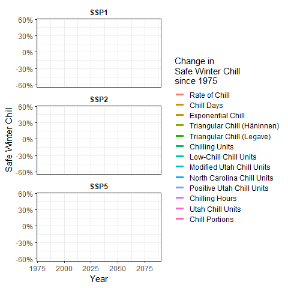

# Chill model comparison {#chill_model_comparison}

## Learning goals for this lesson {-#goals_chill_model}

- Understand and apply the concept of Safe Winter Chill
- Learn how to assess past and future changes in Safe Winter Chill using multiple chill models
- Learn how to illustrate results of such an assessment in a heat map
- Apply lessons learned earlier to plot changes of Safe Winter Chill over time
- Understand how such a plot can be animated using the `gganimate` package

## Safe Winter Chill

I already mentioned the concept of Safe Winter Chill, which is defined as the 10% quantile of the kind of chill distributions we've generated in the previous lessons. For growers, this measure corresponds to the amount of chill that is likely to be exceeded in 90% of all years. A specific tree cultivar with a chilling requirement that corresponds to Safe Winter Chill can be expected to meet this requirement about 90% of the time.

Besides practical usefulness, Safe Winter Chill also offers an opportunity for reducing the complexity of our simulation results by computing the 10% quantiles of each of the distributions we generated. While such a reduction always involves a loss of information, it gives us the opportunity to present our data in different, possibly more attractive, formats. An example of such a format is a heat map, which we'll use here to illustrate differences in the behavior of the various chill models that have been used in the literature (and sometimes in practice).

## Chill metrics

A list of 13 chill metrics has recently been compiled and published by [Eduardo Fernandez](https://scholar.google.de/citations?hl=de&user=ibSma_AAAAAJ), whose [recent paper [@fernandez2020importance]](https://www.sciencedirect.com/science/article/abs/pii/S1161030120301106) provides the blueprint for the present analysis. Eduardo has compiled these models in the `dormancyR` package, which he has made [available via GitHub](https://github.com/EduardoFernandezC/dormancyR). Using the `devtools` package, we can install this directly from github. We also need `chillR`, because Eduardo did not include in this package the chill models that are already contained in `chillR`.
Let's install the `dormancyR` package, load `dormancyR` and `chillR` and check what models are available there. We'll also design nicer names for them that we'll use for the plots later.

```{r, echo=FALSE, message=FALSE}

library(chillR)
library(dormancyR)
library(tidyverse)
library(colorRamps)
library(kableExtra)
library(patchwork)
library(gganimate)

SSPs <- c("ssp126", "ssp245", "ssp370", "ssp585")
Times <- c(2050, 2085)
```

```{r, eval=FALSE}
library(chillR)
library(devtools)
install_github("EduardoFernandezC/dormancyR")
library(dormancyR)
```


```{r}
hourly_models <- list(Chilling_units = chilling_units,
     Low_chill = low_chill_model,
     Modified_Utah = modified_utah_model,
     North_Carolina = north_carolina_model,
     Positive_Utah = positive_utah_model,
     Chilling_Hours = Chilling_Hours,
     Utah_Chill_Units = Utah_Model,
     Chill_Portions = Dynamic_Model)

daily_models <- list(Rate_of_Chill = rate_of_chill,
                     Chill_Days = chill_days,
                     Exponential_Chill = exponential_chill,
                     # Triangular_Chill_Haninnen = triangular_chill_1,
                     Triangular_Chill_Legave = triangular_chill_2)

metrics <- c(names(daily_models),
             names(hourly_models))

model_labels = c("Rate of Chill",
                 "Chill Days",
                 "Exponential Chill",
                 # "Triangular Chill (Häninnen)",
                 "Triangular Chill (Legave)",
                 "Chilling Units",
                 "Low-Chill Chill Units",
                 "Modified Utah Chill Units",
                 "North Carolina Chill Units",
                 "Positive Utah Chill Units",
                 "Chilling Hours",
                 "Utah Chill Units",
                 "Chill Portions")

```

```{r, eval=FALSE}
data.frame(Metric = model_labels, 'Function name' = metrics)
```

```{r, echo=FALSE}

kable(data.frame(Metric = model_labels,'Function name' = metrics))  %>%
  kable_styling("striped", position = "left",font_size = 10)
```

Now we want to apply all these chill models to our observed temperature record, as well as to the past and future temperature scenarios for Bonn. Fortunately, we saved the temperature data, so that we don't have to run the time-consuming weather generation (and climate data download) again. We can simply load these data. Here's how we do this for the past data (we'll load the future scenarios in a loop later):

```{r, eval=FALSE}
Bonn_temps <- read_tab("data/Bonn_temps.csv")

Temps <- load_temperature_scenarios("data",
                                    "Bonn_hist_scenarios")

```

Now we can apply the chill models. We've already seen how we can use models that use hourly temperature data as input. However, some of the models on the list require daily temperature only, so Eduardo wrote the `tempResponse_list_daily` function, which applies similar procedures to daily data. Unlike the `tempResponse_daily_list` function from `chillR`, this function doesn't include a `misstolerance` parameter, so we have to manually remove all years with incomplete winter seasons. We save all results in the `data/chill` folder, using the prefix `Bonn_multichill`:

```{r, eval=FALSE}


Start_JDay <- 305
End_JDay <- 59

daily_models_past_scenarios <- 
  tempResponse_list_daily(Temps,
                          Start_JDay = Start_JDay,
                          End_JDay = End_JDay,
                          models=daily_models)

daily_models_past_scenarios <- lapply(
  daily_models_past_scenarios,
  function(x) x[which(x$Perc_complete>90),])

hourly_models_past_scenarios<-
  tempResponse_daily_list(Temps,
                          latitude = 50.866,
                          Start_JDay = Start_JDay,
                          End_JDay = End_JDay,
                          models = hourly_models,
                          misstolerance = 10)

past_scenarios <- daily_models_past_scenarios

past_scenarios <- lapply(
  names(past_scenarios),
  function(x)
    cbind(past_scenarios[[x]],
          hourly_models_past_scenarios[[x]][,names(hourly_models)]))

names(past_scenarios) <- names(daily_models_past_scenarios)

daily_models_observed <- 
  tempResponse_daily(Bonn_temps,
                     Start_JDay = Start_JDay,
                     End_JDay = End_JDay,
                     models = daily_models)

daily_models_observed <-
  daily_models_observed[which(daily_models_observed$Perc_complete>90),]

hourly_models_observed <- 
  tempResponse_daily_list(Bonn_temps,
                          latitude=50.866,
                          Start_JDay = Start_JDay,
                          End_JDay = End_JDay,
                          models = hourly_models,
                          misstolerance = 10)

past_observed <- cbind(
  daily_models_observed,
  hourly_models_observed[[1]][,names(hourly_models)])

save_temperature_scenarios(past_scenarios,
                           "data/future_climate",
                           "Bonn_multichill_305_59_historic")
write.csv(past_observed,
          "data/future_climate/Bonn_multichill_305_59_observed.csv",
          row.names=FALSE)

```

Now we apply similar procedures to the future data. Since we have eight scenarios again here, it makes sense to design this as a loop:

```{r, eval=FALSE}

SSPs <- c("ssp126", "ssp245","ssp370", "ssp585")
Times <- c(2050, 2085)


list_ssp <- 
  strsplit(names(chill_future_scenario_list), '\\.') %>%
  map(2) %>%
  unlist()

list_gcm <-
  strsplit(names(chill_future_scenario_list), '\\.') %>%
  map(3) %>%
  unlist()

list_time <-
  strsplit(names(chill_future_scenario_list), '\\.') %>%
  map(4) %>%
  unlist()


future_temps <- load_temperature_scenarios("data/future_climate","Bonn_futuretemps")


for(SSP in SSPs)
  for(Time in Times)
    {
    Temps <- future_temps[list_ssp == SSP & list_time == Time]
    names(Temps) <- list_gcm[list_ssp == SSP & list_time == Time]
    daily_models_future_scenarios <- tempResponse_list_daily(
      Temps,
      Start_JDay = Start_JDay,
      End_JDay = End_JDay,
      models = daily_models)
    daily_models_future_scenarios<-lapply(
      daily_models_future_scenarios,
      function(x) x[which(x$Perc_complete>90),])
    hourly_models_future_scenarios<-
      tempResponse_daily_list(
        Temps,
        latitude = 50.866,
        Start_JDay = Start_JDay,
        End_JDay = End_JDay,
        models=hourly_models,
        misstolerance = 10)

    future_scenarios <- daily_models_future_scenarios
    
    future_scenarios <- lapply(
      names(future_scenarios),
      function(x)
        cbind(future_scenarios[[x]],
              hourly_models_future_scenarios[[x]][,names(hourly_models)]))
    names(future_scenarios)<-names(daily_models_future_scenarios)
    
    chill<-future_scenarios
    
    save_temperature_scenarios(
      chill,
      "data/future_climate",
      paste0("Bonn_multichill_305_59_",Time,"_",SSP))
}

```

Now all scenarios we want to process and plot have been saved to disk. We can now load them and produce chill scenarios.


```{r}

chill_past_scenarios <- load_temperature_scenarios(
  "data/future_climate",
  "Bonn_multichill_305_59_historic")

chill_observed <- read_tab("data/future_climate/Bonn_multichill_305_59_observed.csv")


chills <- make_climate_scenario(chill_past_scenarios,
                                caption = "Historical",
                                historic_data = chill_observed,
                                time_series = TRUE)

for(SSP in SSPs)
  for(Time in Times)
    {
    chill <- load_temperature_scenarios(
      "data/future_climate",
      paste0("Bonn_multichill_305_59_",Time,"_",SSP))
    if(SSP == "ssp126") SSPcaption <- "SSP1"
    if(SSP == "ssp245") SSPcaption <- "SSP2"
    if(SSP == "ssp370") SSPcaption <- "SSP3"
    if(SSP == "ssp585") SSPcaption <- "SSP5"    
    if(Time == "2050") Time_caption <- "2050"
    if(Time == "2085") Time_caption <- "2085"
    chills <- make_climate_scenario(chill,
                                    caption = c(SSPcaption,
                                                Time_caption),
                                    add_to = chills)
}

```

Now we want to make a heat map of Safe Winter Chill, using the `ggplot2` functions. This again requires reorganizing our data into a long `data.frame`. We also have to calculate the 10% quantiles from the distributions. Since all the chill models have different units, and numeric values differ greatly across the models, we normalize all the results, expressing them as changes relative to a 1980 baseline:

```{r}

for(i in 1:length(chills))
   {ch <- chills[[i]]
   if(ch$caption[1] == "Historical")
     {GCMs <- rep("none",length(names(ch$data)))
      SSPs <- rep("none",length(names(ch$data)))
      Years <- as.numeric(ch$labels)
      Scenario <- rep("Historical",
                      length(names(ch$data)))} else
                        {GCMs <- names(ch$data)
                        SSPs <- rep(ch$caption[1],
                                    length(names(ch$data)))
                        Years <- rep(as.numeric(ch$caption[2]),
                                     length(names(ch$data)))
                        Scenario <- rep("Future",
                                        length(names(ch$data)))}
   for(nam in names(ch$data))
     {for(met in metrics)
       {temp_res <-
         data.frame(Metric = met,
                    GCM = GCMs[which(nam == names(ch$data))],
                    SSP = SSPs[which(nam == names(ch$data))],
                    Year = Years[which(nam == names(ch$data))],
                    Result = quantile(ch$data[[nam]][,met],0.1), 
                    Scenario = Scenario[which(nam == names(ch$data))])
       if(i == 1 & nam == names(ch$data)[1] & met == metrics[1])
         results <- temp_res else
           results <- rbind(results,
                            temp_res)
         }
     }
   }

for(met in metrics)
  results[which(results$Metric == met),"SWC"] <-
    results[which(results$Metric == met),"Result"]/
      results[which(results$Metric == met & results$Year == 1980),
              "Result"]-1

```

Now we're ready for plotting the results. Since we'll have different panels in this plot and we want axes to be consistent, we need to capture the full range of Safe Winter Chill change values. Then we can make our first heat map plot. Let's start with the future (the ones where the GCM is not 'none'). Note that in the aesthetics we're using `factor` here for the y element. This ensures that the metrics are plotted in the order specified by the `levels` parameter.

```{r}

rng = range(results$SWC)

p_future <- ggplot(results[which(!results$GCM == "none"),],
                   aes(GCM,
                       y = factor(Metric,
                                  levels = metrics),
                       fill = SWC)) +
  geom_tile()

p_future

```

This plot still combines information for both SSPs and both points in time. Let's show these in separate facets:

```{r}
p_future <-
  p_future +
  facet_grid(SSP ~ Year) 

p_future
```

Now can start working on the design. Let's choose the black and white scheme and make the axis text a bit smaller. The latter seems reasonable here, because we have a lot of text there, which will be hard to show at full size.

```{r}
p_future <-
  p_future +
  theme_bw(base_size = 15) +
  theme(axis.text = element_text(size=6))

p_future
```

The current color scheme makes it hard to distinguish subtle differences. Let's use a red to blue color ramp with a few intermediate values. The [`colorRamps`](https://cran.r-project.org/web/packages/colorRamps/colorRamps.pdf) library has a few nice schemes, including the `matlab.like` color ramp, from which we choose 15 equally spaced values. We'll also show the changes in percent, and set the scale limits to the full range of the data we determined earlier:

```{r}
library(colorRamps)
p_future <-
  p_future +
  scale_fill_gradientn(colours = matlab.like(15),
                       labels = scales::percent,
                       limits = rng)

p_future
```

We still need a few cosmetic adjustments. Let's change the angle of the x-axis labels to 75°, so that the labels are actually readable. We'll also add a nicer title to the legend (note the 'backslash n' commands that stand for line breaks), replace the automatic axis labels with the nicer ones we designed above and change the label of the y-axis to "Chill metric".

```{r}

p_future <-
  p_future  +
  theme(axis.text.x = element_text(angle = 75, 
                                   hjust = 1,
                                   vjust = 1)) +
  labs(fill = "Change in\nSafe Winter Chill\nsince 1980") +
  scale_y_discrete(labels = model_labels) +
  ylab("Chill metric")

p_future

```

Now we can make the plot of past scenarios. The procedure is largely the same as above, so I'm not going to go through this in such detail. Note that we're moving the x-axis to the top using the `scale_x_continuous(position = "top")` command.

```{r}


p_past<-
  ggplot(results[which(results$GCM == "none"),],
         aes(Year,
             y = factor(Metric, 
                        levels=metrics),
             fill = SWC)) +
  geom_tile()

p_past<-
  p_past +
  theme_bw(base_size = 15) +
  theme(axis.text = element_text(size = 6))

p_past<-
  p_past +
  scale_fill_gradientn(colours = matlab.like(15),
                       labels = scales::percent,
                       limits = rng)

p_past<-
  p_past +
  scale_x_continuous(position = "top") 

p_past<-
  p_past +
  labs(fill = "Change in\nSafe Winter Chill\nsince 1980") +
  scale_y_discrete(labels = model_labels) +
  ylab("Chill metric")

p_past

```

Now we can combine the plots. We'll again use the [`patchwork`](https://cran.r-project.org/web/packages/patchwork/patchwork.pdf) package for this. The layout is a bit different here from last time. Mainly the plots are now on top of each other (`nrow=2`, with relative heights specified by `heights=c(1,2)`). The changes to the facet strip now only come in at this stage. It's handy that we can still specify this here, because now we can just write this command once, rather than separately for each of the subplots.

```{r}
chill_comp_plot<-
  (p_past +
     p_future +
     plot_layout(guides = "collect",
                 nrow = 2,
                 heights = c(1,3))) &
  theme(legend.position = "right",
        strip.background = element_blank(),
        strip.text = element_text(face = "bold"))

chill_comp_plot
```

This is it. Note the major differences between the behaviors of the various model. Some models indicate that Safe Winter Chill is increasing, while other say it's decreasing. This is a clear indication that model choice matters! 

## An animated plot of relative changes in Safe Winter Chill

Finally, let's explore another R package - [`gganimate`](https://cran.r-project.org/web/packages/gganimate/gganimate.pdf) - which can add a cool feature to figures produced with [`ggplot2`](https://cran.r-project.org/web/packages/ggplot2/ggplot2.pdf). 

To make use of this, let's produce a simpler representation of the Safe Winter Chill data. For this, let's summarize the results across all the GCMs. We'll also duplicate the historic data and assign one of each of the duplicates to each SSP scenario. This is needed for easily plotting the full time series, disaggregated by SSP.

```{r}

hist_results <- results[which(results$GCM == "none"),]
hist_results$SSP <- "SSP1"
hist_results_2 <- hist_results
hist_results_2$SSP <- "SSP2"
hist_results_3 <- hist_results
hist_results_3$SSP <- "SSP3"
hist_results_4 <- hist_results
hist_results_4$SSP <- "SSP5"
hist_results <- rbind(hist_results,
                      hist_results_2,
                      hist_results_3,
                      hist_results_4)

future_results <- results[which(!results$GCM == "none"),]

GCM_aggregate <- aggregate(
  future_results$SWC,
  by=list(future_results$Metric,
          future_results$SSP,
          future_results$Year),
  FUN=mean)

colnames(GCM_aggregate) <- c("Metric",
                             "SSP",
                             "Year",
                             "SWC")

SSP_Time_series<-rbind(hist_results[,c("Metric",
                                       "SSP",
                                       "Year",
                                       "SWC")],
                       GCM_aggregate)

```

Now we can make a line plot showing changes in Safe Winter Chill over the two SSP scenarios for all of the chill metrics. This is very similar to the procedures above, except that now we're using the `geom_line` command rather than `geom_tile` (there are some more minor differences).

```{r}

SSP_Time_series$Year <- as.numeric(SSP_Time_series$Year)

chill_change_plot<-
  ggplot(data = SSP_Time_series,
         aes(x = Year,
             y = SWC,
             col = factor(Metric,
                          levels = metrics))) +
  geom_line(lwd = 1.3) +
  facet_wrap(~SSP,
             nrow = 4) +
  theme_bw(base_size = 10) +
  labs(col = "Change in\nSafe Winter Chill\nsince 1980") +
  scale_color_discrete(labels = model_labels) +
  scale_y_continuous(labels = scales::percent) +
  theme(strip.background = element_blank(),
        strip.text = element_text(face = "bold")) +
  ylab("Safe Winter Chill")

chill_change_plot

```

Now as a final step, we'll convert this into a moving picture using the `transition_reveal` function from the [`gganimate`](https://cran.r-project.org/web/packages/gganimate/gganimate.pdf) package. We'll save the resulting animation.

```{r, eval=FALSE}
library(gganimate)
library(gifski)
library(png)
library(transformr)

ccp<-chill_change_plot +
  transition_reveal(Year)

animate(ccp, fps = 10)

anim_save("data/chill_comparison_animation.gif",
          animation = last_animation())
```




## `Exercises` on chill model comparison {-#exercises_chill_model_comparison}

Please document all results of the following assignments in your `learning logbook`.

1) Perform a similar analysis for the location you've chosen for your exercises.
2) Make a heat map illustrating past and future changes in Safe Winter Chill, relative to a past scenario, for the 13 chill models used here
3) Produce an animated line plot of your results (summarizing Safe Winter Chill across all the GCMs).