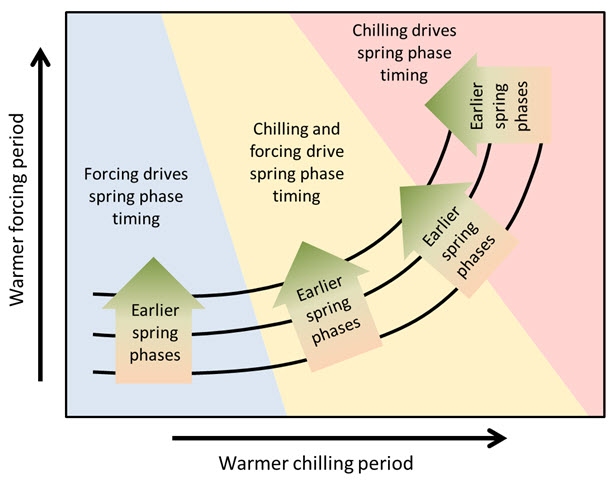

# The relative importance of chill and heat  {#pls_chillforce_relimp}

## Learning goals for this lesson {-#goals_PLS_chillforce_relimp}

- Get an overview of temperature response patterns of temperate tree species across a range of climates
- Become familiar with a general hypothesis of how temperate trees respond to warming during the chilling and forcing phases
- Consider evidence in favor of this hypothesis, as well well as implications for phenology changes in response to climate change

## Chilling vs. forcing temperatures

In the last chapter, we related mean temperatures during the chilling and forcing phases to bloom dates of 'Alexander Lucas' pears.

We did a similar analysis for leaf emergence dates of the walnut cultivar 'Payne' in Davis, California.

It was somewhat difficult to detect a clear pattern for the pears in Klein-Altendorf, but the walnut analysis showed a fairly clear pattern, with the earliest leaf emergence dates corresponding to cool conditions during endodormancy and relatively high temperatures during ecodormancy. This is in line with what we know about the dormancy phase, which should be shortened by abundant chill during endodormancy and by lots of heat during ecodormancy. Given what we learned about the temperature chill relationship in the chapter on [Why PLS doesn't always work], we should not be surprised to see the kind of temperature response curve that's shown in the plot.

But what do we see in different climatic settings? There have been a number of similar analyses by now, so let's look at what came out of these.

One of the first plots was produced for chestnuts in Beijing:

![Bloom dates of chestnuts in Beijing, as a function of mean temperatures during the chilling and forcing phases [[@guo2013response]](https://www.sciencedirect.com/science/article/abs/pii/S0168192313001627) ](pictures/Rainbow_chestnuts.jpg)

Here you can see the plot for cherries in Klein-Altendorf:

![Bloom dates of cherries 'Schneiders späte Knorpelkirsche' in Klein-Altendorf, as a function of mean temperatures during the chilling and forcing phases [[@luedeling2013differential]](https://doi.org/10.1016/j.agrformet.2013.06.018) ](pictures/Rainbow_cherries_Klein-Altendorf.jpg)

And this is the figure for apricots in the UK:

![Bloom dates of apricots in the UK, as a function of mean temperatures during the chilling and forcing phases [[@martinez2017delayed]](https://doi.org/10.1016/j.agrformet.2017.02.017)](pictures/Rainbow_apricots_UK.jpg)

## Patterns in temperature responses

You'll have noticed that the general color scheme is the same, and there's a tendency for the earliest dates to be in the upper left corner and the latest dates at the bottom right. There are also some differences, however, in the appearance of these plots, in particular regarding the slope of the color gradient. Admittedly, these differences didn't come out too clearly in the plots we just looked at, but we can see what's going on when we look at such plots across a climatic gradient.

To explore tree phenology responses along a temperature gradient, we compared apricot bloom data from five locations across China:

![Study locations in China used to study phenology responses to temperature across a temperature gradient [[@guo2015responses]](https://doi.org/10.1016/j.agrformet.2014.10.016)](pictures/map_China.jpg)

As you can see below, winter temperatures at these five locations are quite different:

![Temperature profiles of the study locations in China  [[@guo2015responses]](https://doi.org/10.1016/j.agrformet.2014.10.016)](pictures/temperatures_China.jpg)

For each of these locations, we found phenology data in the Chinese Phenology database and did similar analyses to what we've looked at so far. I should note that these were different apricot cultivars, which represents a potential source of error. It's hard to display the full color surfaces for all five locations in the same figure, so the following plot only shows the contour lines:

![Bloom dates of apricots in five locations in China, as a function of mean temperatures during the chilling and forcing phases [[@guo2015responses]](https://doi.org/10.1016/j.agrformet.2014.10.016)](pictures/contours_China.jpg)

With increasing temperature, we see increasingly steep contour lines. While these lines were almost horizontal for Jiamusi, the coldest location, they are approximately diagonal for Guiyang, the warmest site. All other sites fit nicely on the gradient between cold and warm, along which their contour lines show increasingly steep slopes.

What we found here looks like there could be a general pattern in the temperature response of temperate trees. We illustrated this temperature response hypothesis in the following figure (original in grayscale in @guo2015responses):

According to this hypothesis, spring phenology of trees growing in cold-winter climates should respond primarily to temperatures during ecodormancy, when buds are responsive to heat. Chill accumulation there, at the left end of this figure, is probably so high, and winter temperatures are so favorable for chill accumulation, that the usual temperature variation during this period has little to no effect. Such a temperature response situation might explain why we've been having such a hard time delineating the chilling period in cold places (note of course that such ambiguous delineations are the basis for these figures).

As endodormancy temperatures increase, conditions during chill accumulation start showing an effect. We're now entering the yellow area in the diagram, where contour lines start bending upwards, indicating that warm chilling periods now add a delaying effect to the still dominant influence of forcing temperatures. As we transition through the yellow region, this delaying effect gets increasingly stronger.

Eventually, with further increases in temperature, we reach a point where temperature conditions during chill accumulation take over as the dominant effect. At this point, we might be in a situation where temperature increases no longer lead to advancing phenology, but first to stagnation and ultimately even to delays in budbreak dates.

This is only a hypothesis for now, so we should look for ways to test it.

A bit more weight was added to this hypothesis by an analysis done on 'Fuji' apples at 4 locations in Shaanxi Province in China.

The temperature gradient here isn't quite as impressive as in the larger-scale study on apricots, but there is still some variation here, and now we're actually working with the same apple cultivar across all four locations:

![Study locations in Shaanxi, China [[@guo2019distribution]](https://doi.org/10.1016/j.agrformet.2019.01.038) ](pictures/temps_Shaanxi.jpg)

Mean temperatures during the chilling season ranged from 2.6°C to 6.0°C, and the overall range of chilling season temperatures ranged from about 1°C to approximately 7°C. Results from the contour analysis indicate that these differences had a distinct impact on the bloom date response to temperature during chilling and forcing:

![Bloom date response of 'Fuji' apples across four locations in Shaanxi Province, China, to temperatures during the chilling and forcing periods [[@guo2019distribution]](https://doi.org/10.1016/j.agrformet.2019.01.038) ](pictures/Shaanxi_contours.jpg)

I once enjoyed the privilege of visiting the coldest location, Yan'an, in winter, and I can confirm that it's pretty cold there... Accordingly, the contour lines in the diagram are quite close to horizontal. For the warmer sites, especially for Liquan, we see a very different pattern, with a marked bloom-delaying effect of high temperatures during endodormancy.

## The warm end of the spectrum

So far, all the temperature response curves we looked at, even the whole range of the temperature gradients from China, featured relatively cool conditions. With a bit of imagination, we can easily fit all these locations within our temperature response hypothesis. However, the boldest predictions concern the warmest end of the temperature spectrum, for which we're expecting a net delay in spring phenology in response to warming.

Delayed phenology is not something you find often in the scientific literature, where the expectation of continually advancing bloom and leaf emergence dates is currently dominant. Interestingly, however, even some of the key references on such phenology advances (like this one: @parmesan2003globally) contain, besides lots of data indicating advancing phenology, also a few records that point in the opposite direction. These could be measurement errors of course, but they may also indicate that something else is going on here. In the context of our line of work, testing the warm end of our hypothetical temperature response curve would require phenology data from a really warm location. Unfortunately, at such warm locations, people usually don't grow temperate fruit trees. Or do they?

Maybe you can imagine that I was quite excited when I was contacted in 2015 by [Haïfa Benmoussa](https://scholar.google.com/citations?user=DdV9jsAAAAAJ&hl) from Tunisia, who was working with long-term phenology records from this really warm growing region for her PhD. You've already seen some of her results in earlier chapters. What I was most excited about was the prospect of drawing contour lines for trees grown under really warm conditions that might help test our temperature response hypothesis.

Here's what we found for almonds grown in Central Tunisia:

![Temperature response of local almond cultivars in Sfax, Tunisia  [[@benmoussa2017chilling]](https://doi.org/10.1016/j.agrformet.2017.02.030)](pictures/rainbow_local_almonds.jpg)

These are local almond cultivars, so we can expect them to be pretty well adapted to local temperature conditions. Let's look at some 'foreign' cultivars that were imported from cooler locations:

![Temperature response of foreign almond cultivars in Sfax, Tunisia  [[@benmoussa2017chilling]](https://doi.org/10.1016/j.agrformet.2017.02.030)](pictures/rainbow_foreign_almonds.jpg)

We see variation in temperature response slopes, but the array of cultivars observed here certainly includes some that responded more strongly to temperatures during chilling than during forcing.

Almonds generally have a fairly low chilling requirement, making them suitable for a lot of Mediterranean-climate growing regions, such as California, Spain or Tunisia. The situation is a bit different for pistachios, which are also grown in many of these regions but grow leaves and flowers much later and are believed to need more chill than almonds.

The colleagues in Sfax have also been collecting phenology data for pistachios, and the contour plots are rather striking:

![Temperature response of pistachios in Sfax, Tunisia, to temperatures during the chilling and forcing phases [[@benmoussa_performance_2017]](https://doi.org/10.1016/j.envexpbot.2017.05.007)](pictures/rainbow_pistachios.jpg)

Here, we actually see the vertical contour lines that our hypothesis predicted!

Have we now proven our hypothesis? Well, no. It's hard to prove anything in science (unless you're in Mathematics). We can only ever hope to *support* our hypotheses, not really prove them (or we can *reject* them sometimes). To really firmly conclude that we've described the temperature response pattern well, we'd need more evidence from more species in more places (lots of opportunities to get involved here).

## Implications of our hypothesis

If our temperature response hypothesis is correct, we should be looking out for signals in phenology dynamics that are not well aligned with the notion of ever-advancing phenology. We should be expecting strong advances up to a certain point, but with continued warming, we should also expect a slowdown in these advances. Eventually, phenology may stagnate, and at some point, we may even see a shift to noticeable phenology delays. I've seen a few papers that point in this direction, but I don't think there's been a lot of systematic work on this (another opportunity to get involved).

## `Exercises` on the relative importance of chill and heat {-#exercises_PLS_chillforce_relimp}

Please document all results of the following assignments in your `learning logbook`.

1) Describe the temperature response hypothesis outlined in this chapter.
