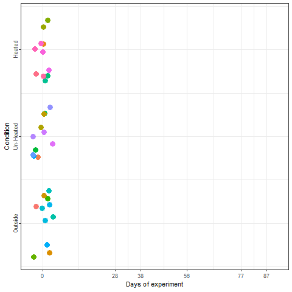
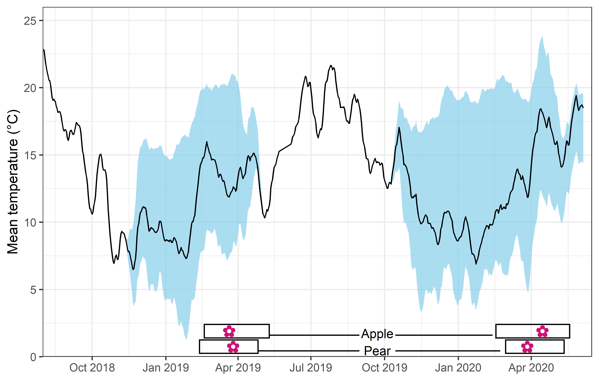

# Experimentally enhanced PLS {#exp_PLS}

## Learning goals for this lesson {#goals_exp_PLS .unnumbered}

-   Learn how to enhance your phenology records
-   Get some insights into work conducted in our lab

## Enhanced phenology data

We've learned about the difficulty of working with data from locations such as Klein-Altendorf, where temperature dynamics limit our ability to probe for phenology responses to chill and heat variation (because there is very little variation during certain months). Can we possibly find a way to *enhance* our dataset, so that it becomes more amenable to the kind of analysis we want to do?

Yes, we can! And that is what we did in a two-winter experiment in Campus Klein-Altendorf [@fernandezboosting]. Our experiment relied on generating a number of *environments* to which young potted trees were exposed over the winter. During the season 2018/2019, we used three environmental conditions:

```{r echo = FALSE, message = FALSE}
library(cowplot)
library(magick)
ggdraw() + draw_image("pictures/PLS_exp_outside.jpg", -0.36, 0, 1, 1, 0.35) +
  draw_image("pictures/PLS_exp_unheated.jpg", 0.09, 0, 0.8, 1, 0.415) +
  draw_image("pictures/PLS_exp_heated.jpg", 0.34, 0, 1, 1, 0.35) +
  draw_plot_label(c("Outside", "Un-heated", "Heated"), x = c(0.125, 0.45, 0.8), y = 0.7, 
                  size = 11, hjust = 0, vjust = 0)
```

During the second winter (2019/2020), we added 4 more environments to the experiment. These new environments were three chambers covered with different materials plus the conditions outside these chambers in Campus Endenich of the University of Bonn. By transferring the trees across environments at different times, we were able to generate 66 *experimental* seasons in apple and 33 *experimental* seasons in pear.

In the plot below, we can take a look at a schematic representation (animated🙂) of the experiment using the libraries `ggplot2` and `gganimate`. Note that most of the code for plotting is a common `ggplot` call using the `geom_jitter()` and `geom_path()` functions. We can later add the animation with the `transition_reveal()` function.

We'll need the `interactive_plot_PLS.csv` file, which you can download here. As usual, please save this in your `data` directory.

```{r, echo=FALSE, warning = FALSE}
data <- read_tab("data/interactive_plot_PLS.csv")
data %>% download_this(
    output_name = "interactive_plot_PLS",
    output_extension = ".csv",
    button_label = "Download interactive plot data",
    button_type = "warning",
    has_icon = TRUE,
    icon = "fa fa-save"
  )
```

```{r echo = TRUE, message = FALSE, eval = FALSE}
library(ggplot2)
library(gganimate)
library(gifski)
library(png)

data <- read_tab("data/interactive_plot_PLS.csv")

# This part is to re-code the different conditions
data[which(data$Final_Condition == "Outside"), 
     "Final_condition_2"] <- 1
data[which(data$Final_Condition == "Un-heated"),
     "Final_condition_2"] <- 2
data[which(data$Final_Condition == "Heated"),
     "Final_condition_2"] <- 3

# Implement the plot
exp_plot <- 
  ggplot(data,
       aes(Day, 
           Final_condition_2,
           color = factor(Treatment,
                          levels = c(1 : 33)))) +
  geom_jitter(size = 4) +
  geom_path(size = 1) +
  scale_y_continuous(breaks = c(1, 
                                2,
                                3),
                     labels = c("Outside",
                                "Un-Heated",
                                "Heated")) +
  scale_x_continuous(breaks = as.numeric(levels(as.factor(data$Day))),
                     labels = levels(as.factor(data$Day))) +
  labs(x = "Days of experiment",
       y = "Condition",
       color = "Treatment") +
  theme_bw() +
  theme(axis.text.y = element_text(angle = 90, 
                                   hjust = 0.5),
        legend.position = "none") +
  transition_reveal(Day)

anim_save("data/interactive_experiment_plot.gif",
          animation = last_animation())

```



We recorded the date of bloom in our trees after exposing them to different temperature patterns over the winter period. This range of conditions resulted in substantial differences in bloom dates.


In the plot above, you can see the mean temperature (solid line), the range of mean temperature (sky blue shade) and the range of bloom dates (rectangles at the bottom) among treatments over the two winters.

Now that we know how the data were generated, we can take a look at some of the general results generated by this study. Let's load the weather files and the file of flowering date observations for apples (and save them in the `data` directory):

```{r, echo=FALSE, warning = FALSE}
pheno_data <- read_tab("data/final_bio_data_S1_S2_apple.csv")
pheno_data %>% download_this(
    output_name = "final_bio_data_S1_S2_apple",
    output_extension = ".csv",
    button_label = "Download phenology data",
    button_type = "warning",
    has_icon = TRUE,
    icon = "fa fa-save"
  )

weather_data <- read_tab("data/final_weather_data_S1_S2.csv")
weather_data %>% download_this(
    output_name = "final_weather_data_S1_S2",
    output_extension = ".csv",
    button_label = "Download weather data",
    button_type = "warning",
    has_icon = TRUE,
    icon = "fa fa-save"
  )
```


```{r, message=FALSE}
library(chillR)
library(lubridate)

pheno_data <- read_tab("data/final_bio_data_S1_S2_apple.csv")
weather_data <- read_tab("data/final_weather_data_S1_S2.csv")
```

We'll need some functions we produced in earlier chapters:

-   `ggplot_PLS` from the chapter on [Delineating temperature response phases with PLS regression]
-   `plot_PLS_chill_force` from the chapter on [PLS regression with agroclimatic metrics]
-   `pheno_trend_ggplot` from the chapter on [Evaluating PLS outputs]
-   `Chill_model_sensitivity` from the chapter on [Why PLS doesn't always work]
-   `Chill_sensitivity_temps` from the chapter on [Why PLS doesn't always work]

I'm loading them again now, but you don't need to see this again, so I'm setting the chunk options to `echo=FALSE, message=FALSE, warning=FALSE`.

```{r, echo=FALSE, message=FALSE, warning=FALSE}

library(ggplot2)
library(colorRamps)
library(patchwork)
library(fields)
library(reshape2)
library(metR)


ggplot_PLS<-function(PLS_results)
{
  library(ggplot2)
  PLS_gg<-PLS_results$PLS_summary
  PLS_gg[,"Month"]<-trunc(PLS_gg$Date/100)
  PLS_gg[,"Day"]<-PLS_gg$Date-PLS_gg$Month*100
  PLS_gg[,"Date"]<-ISOdate(2002,PLS_gg$Month,PLS_gg$Day)
  PLS_gg[which(PLS_gg$JDay<=0),"Date"]<-ISOdate(2001,PLS_gg$Month[which(PLS_gg$JDay<=0)],PLS_gg$Day[which(PLS_gg$JDay<=0)])
  PLS_gg[,"VIP_importance"]<-PLS_gg$VIP>=0.8
  PLS_gg[,"VIP_Coeff"]<-factor(sign(PLS_gg$Coef)*PLS_gg$VIP_importance)
  
  VIP_plot<- ggplot(PLS_gg,aes(x=Date,y=VIP)) +
  geom_bar(stat='identity',aes(fill=VIP>0.8)) +
  scale_fill_manual(name="VIP", 
                    labels = c("<0.8", ">0.8"), 
                    values = c("FALSE"="grey", "TRUE"="blue")) +
  theme_bw(base_size=15) +
  theme(axis.text.x = element_blank(),
        axis.ticks.x = element_blank(),
        axis.title.x = element_blank() )
  
  coeff_plot<- ggplot(PLS_gg,aes(x=Date,y=Coef)) +
  geom_bar(stat='identity',aes(fill=VIP_Coeff)) +
  scale_fill_manual(name="Effect direction", 
                    labels = c("Advancing", "Unimportant","Delaying"), 
                    values = c("-1"="red", "0"="grey","1"="dark green")) +
  theme_bw(base_size=15) +
  ylab("PLS coefficient") +
  theme(axis.text.x = element_blank(),
        axis.ticks.x = element_blank(),
        axis.title.x = element_blank() )
  
  temp_plot<- ggplot(PLS_gg) +
    geom_ribbon(aes(x=Date,ymin=Tmean-Tstdev,ymax=Tmean+Tstdev),fill="grey") +
    geom_ribbon(aes(x=Date,ymin=Tmean-Tstdev*(VIP_Coeff==-1),ymax=Tmean+Tstdev*(VIP_Coeff==-1)),fill="red") +
    geom_ribbon(aes(x=Date,ymin=Tmean-Tstdev*(VIP_Coeff==1),ymax=Tmean+Tstdev*(VIP_Coeff==1)),fill="dark green") +
    geom_line(aes(x=Date,y=Tmean)) +
    theme_bw(base_size=15) +
    ylab(expression(paste(T[mean]," (°C)")))

  library(patchwork)
  plot<- (VIP_plot +
            coeff_plot +
            temp_plot +
            plot_layout(ncol=1,
                        guides = "collect")
          ) & theme(legend.position = "right",
                    legend.text = element_text(size=8),
                    legend.title = element_text(size=10),
                    axis.title.x=element_blank())

plot
}

plot_PLS_chill_force<-function(plscf,
                               chill_metric="Chill_Portions",
                               heat_metric="GDH",
                               chill_label="CP",
                               heat_label="GDH",
                               chill_phase=c(-48,62),
                               heat_phase=c(-5,105.5))
{
  PLS_gg<-plscf[[chill_metric]][[heat_metric]]$PLS_summary
  PLS_gg[,"Month"]<-trunc(PLS_gg$Date/100)
  PLS_gg[,"Day"]<-PLS_gg$Date-PLS_gg$Month*100
  PLS_gg[,"Date"]<-ISOdate(2002,PLS_gg$Month,PLS_gg$Day)
  PLS_gg[which(PLS_gg$JDay<=0),"Date"]<-ISOdate(2001,PLS_gg$Month[which(PLS_gg$JDay<=0)],PLS_gg$Day[which(PLS_gg$JDay<=0)])
  PLS_gg[,"VIP_importance"]<-PLS_gg$VIP>=0.8
  PLS_gg[,"VIP_Coeff"]<-factor(sign(PLS_gg$Coef)*PLS_gg$VIP_importance)
  
  chill_start_date<-ISOdate(2001,12,31)+chill_phase[1]*24*3600
  chill_end_date<-ISOdate(2001,12,31)+chill_phase[2]*24*3600
  heat_start_date<-ISOdate(2001,12,31)+heat_phase[1]*24*3600
  heat_end_date<-ISOdate(2001,12,31)+heat_phase[2]*24*3600

  
  temp_plot<- ggplot(PLS_gg) +
    annotate("rect",
             xmin = chill_start_date,
             xmax = chill_end_date,
             ymin = -Inf,
             ymax = Inf,
             alpha = .1,fill = "blue") +
    annotate("rect",
             xmin = heat_start_date,
             xmax = heat_end_date,
             ymin = -Inf,
             ymax = Inf,
             alpha = .1,fill = "red") +
    annotate("rect",
             xmin = ISOdate(2001,12,31) + min(plscf$pheno$pheno,na.rm=TRUE)*24*3600,
             xmax = ISOdate(2001,12,31) + max(plscf$pheno$pheno,na.rm=TRUE)*24*3600,
             ymin = -Inf,
             ymax = Inf,
             alpha = .1,fill = "black") +
    geom_vline(xintercept = ISOdate(2001,12,31) + median(plscf$pheno$pheno,na.rm=TRUE)*24*3600, linetype = "dashed") +
    geom_ribbon(aes(x=Date,
                    ymin=MetricMean - MetricStdev ,
                    ymax=MetricMean + MetricStdev ),
                fill="grey") +
    geom_ribbon(aes(x=Date,
                    ymin=MetricMean - MetricStdev * (VIP_Coeff==-1),
                    ymax=MetricMean + MetricStdev * (VIP_Coeff==-1)),
                fill="red") +
    geom_ribbon(aes(x=Date,
                    ymin=MetricMean - MetricStdev * (VIP_Coeff==1),
                    ymax=MetricMean + MetricStdev * (VIP_Coeff==1)),
                fill="dark green") +
    geom_line(aes(x=Date,y=MetricMean )) +
    facet_wrap(vars(Type), scales = "free_y",
               strip.position="left",
               labeller = labeller(Type = as_labeller(c(Chill=paste0("Chill (",chill_label,")"),Heat=paste0("Heat (",heat_label,")")) )) ) +
    ggtitle("Daily chill and heat accumulation rates") +
    theme_bw(base_size=15) + 
    theme(strip.background = element_blank(),
          strip.placement = "outside",
          strip.text.y = element_text(size =12),
          plot.title = element_text(hjust = 0.5),
          axis.title.y=element_blank()
          )
  
  VIP_plot<- ggplot(PLS_gg,aes(x=Date,y=VIP)) +
    annotate("rect",
             xmin = chill_start_date,
             xmax = chill_end_date,
             ymin = -Inf,
             ymax = Inf,
             alpha = .1,fill = "blue") +
    annotate("rect",
             xmin = heat_start_date,
             xmax = heat_end_date,
             ymin = -Inf,
             ymax = Inf,
             alpha = .1,fill = "red") +
    annotate("rect",
             xmin = ISOdate(2001,12,31) + min(plscf$pheno$pheno,na.rm=TRUE)*24*3600,
             xmax = ISOdate(2001,12,31) + max(plscf$pheno$pheno,na.rm=TRUE)*24*3600,
             ymin = -Inf,
             ymax = Inf,
             alpha = .1,fill = "black") +
    geom_vline(xintercept = ISOdate(2001,12,31) + median(plscf$pheno$pheno,na.rm=TRUE)*24*3600, linetype = "dashed") +
    geom_bar(stat='identity',aes(fill=VIP>0.8)) +
    facet_wrap(vars(Type), scales="free",
               strip.position="left",
               labeller = labeller(Type = as_labeller(c(Chill="VIP for chill",Heat="VIP for heat") )) ) +
    scale_y_continuous(limits=c(0,max(plscf[[chill_metric]][[heat_metric]]$PLS_summary$VIP))) +
    ggtitle("Variable Importance in the Projection (VIP) scores") +
    theme_bw(base_size=15) + 
    theme(strip.background = element_blank(),
          strip.placement = "outside",
          strip.text.y = element_text(size =12),
          plot.title = element_text(hjust = 0.5),
          axis.title.y=element_blank()
          ) +
    scale_fill_manual(name="VIP", 
                      labels = c("<0.8", ">0.8"), 
                      values = c("FALSE"="grey", "TRUE"="blue")) +
    theme(axis.text.x = element_blank(),
          axis.ticks.x = element_blank(),
          axis.title.x = element_blank(),
          axis.title.y = element_blank())
  
  coeff_plot<- ggplot(PLS_gg,aes(x=Date,y=Coef)) +
    annotate("rect",
             xmin = chill_start_date,
             xmax = chill_end_date,
             ymin = -Inf,
             ymax = Inf,
             alpha = .1,fill = "blue") +
    annotate("rect",
             xmin = heat_start_date,
             xmax = heat_end_date,
             ymin = -Inf,
             ymax = Inf,
             alpha = .1,fill = "red") +
    annotate("rect",
             xmin = ISOdate(2001,12,31) + min(plscf$pheno$pheno,na.rm=TRUE)*24*3600,
             xmax = ISOdate(2001,12,31) + max(plscf$pheno$pheno,na.rm=TRUE)*24*3600,
             ymin = -Inf,
             ymax = Inf,
             alpha = .1,fill = "black") +
    geom_vline(xintercept = ISOdate(2001,12,31) + median(plscf$pheno$pheno,na.rm=TRUE)*24*3600, linetype = "dashed") +
    geom_bar(stat='identity',aes(fill=VIP_Coeff)) +
    facet_wrap(vars(Type), scales="free",
               strip.position="left",
               labeller = labeller(Type = as_labeller(c(Chill="MC for chill",Heat="MC for heat") )) ) +
    scale_y_continuous(limits=c(min(plscf[[chill_metric]][[heat_metric]]$PLS_summary$Coef),
                                max(plscf[[chill_metric]][[heat_metric]]$PLS_summary$Coef))) +
    ggtitle("Model coefficients (MC)") +
    theme_bw(base_size=15) + 
    theme(strip.background = element_blank(),
          strip.placement = "outside",
          strip.text.y = element_text(size =12),
          plot.title = element_text(hjust = 0.5),
          axis.title.y=element_blank()
          ) +
    scale_fill_manual(name="Effect direction", 
                      labels = c("Advancing", "Unimportant","Delaying"), 
                      values = c("-1"="red", "0"="grey","1"="dark green")) +
    ylab("PLS coefficient") +
    theme(axis.text.x = element_blank(),
          axis.ticks.x = element_blank(),
          axis.title.x = element_blank(),
          axis.title.y = element_blank())
  
  library(patchwork)
  
  plot<- (VIP_plot +
            coeff_plot +
            temp_plot +
            plot_layout(ncol=1,
                        guides = "collect")
          ) & theme(legend.position = "right",
                    legend.text = element_text(size=8),
                    legend.title = element_text(size=10),
                    axis.title.x=element_blank())

plot

}


pheno_trend_ggplot<-function(temps,
                             pheno,
                             chill_phase,
                             heat_phase,
                             exclude_years=NA,
                             phenology_stage="Bloom")
{
  library(fields)
  library(reshape2)
  library(metR)
  library(ggplot2)
  library(colorRamps)
  
  # first, a sub-function (function defined within a function) to
  # compute the temperature means
  
  mean_temp_period<-function(temps,
                             start_JDay,
                             end_JDay, 
                             end_season = end_JDay)
    { temps_JDay<-make_JDay(temps)
    temps_JDay[,"Season"]<-temps_JDay$Year
    if(start_JDay>end_season)
      temps_JDay$Season[which(temps_JDay$JDay>=start_JDay)]<-
      temps_JDay$Year[which(temps_JDay$JDay>=start_JDay)]+1
    if(start_JDay>end_JDay)
      sub_temps<-subset(temps_JDay,JDay<=end_JDay|JDay>=start_JDay)
    if(start_JDay<=end_JDay)
      sub_temps<-subset(temps_JDay,JDay<=end_JDay&JDay>=start_JDay)
    mean_temps<-aggregate(sub_temps[,c("Tmin","Tmax")],
                          by=list(sub_temps$Season),
                          FUN=function(x) mean(x, na.rm=TRUE))
    mean_temps[,"n_days"]<-aggregate(sub_temps[,"Tmin"],
                                     by=list(sub_temps$Season),
                                     FUN=length)[,2]
    mean_temps[,"Tmean"]<-(mean_temps$Tmin+mean_temps$Tmax)/2
    mean_temps<-mean_temps[,c(1,4,2,3,5)]
    colnames(mean_temps)[1]<-"End_year"
    return(mean_temps)
    }
  
  mean_temp_chill<-mean_temp_period(temps = temps,
                                    start_JDay = chill_phase[1],
                                    end_JDay = chill_phase[2],
                                    end_season = heat_phase[2])
  
  mean_temp_heat<-mean_temp_period(temps = temps,
                                   start_JDay = heat_phase[1],
                                   end_JDay = heat_phase[2],
                                   end_season = heat_phase[2])
  
  mean_temp_chill<-
    mean_temp_chill[which(mean_temp_chill$n_days >= 
                            max(mean_temp_chill$n_days)-1),]
  mean_temp_heat<-
    mean_temp_heat[which(mean_temp_heat$n_days >= 
                           max(mean_temp_heat$n_days)-1),]
  mean_chill<-mean_temp_chill[,c("End_year","Tmean")]
  colnames(mean_chill)[2]<-"Tmean_chill"
  mean_heat<-mean_temp_heat[,c("End_year","Tmean")]
  colnames(mean_heat)[2]<-"Tmean_heat"
  phase_Tmeans<-merge(mean_chill,mean_heat, by="End_year")
  
  colnames(pheno)<-c("End_year","pheno")
  Tmeans_pheno<-merge(phase_Tmeans,pheno, by="End_year")
  
  if(!is.na(exclude_years[1]))
    Tmeans_pheno<-Tmeans_pheno[which(!Tmeans_pheno$End_year %in% exclude_years),]
  
  # Kriging interpolation
  k<-Krig(x=as.matrix(Tmeans_pheno[,c("Tmean_chill","Tmean_heat")]),
          Y=Tmeans_pheno$pheno)
  pred<-predictSurface(k)
  predictions<-as.data.frame(pred$z)
  
  colnames(predictions) <- pred$y
  predictions <- data.frame(Tmean_chill = pred$x, predictions)

  melted<-melt(predictions,na.rm=TRUE,id.vars="Tmean_chill")
  colnames(melted)<-c("Tmean_chill","Tmean_heat","value")
  melted$Tmean_heat<-unique(pred$y)[as.numeric(melted$Tmean_heat)]

  
  ggplot(melted,aes(x=Tmean_chill,y=Tmean_heat,z=value)) +
    geom_contour_fill(bins=60) +
    scale_fill_gradientn(colours=alpha(matlab.like(15)),
                         name=paste(phenology_stage,"date \n(day of the year)")) +
    geom_contour(col="black") +
    geom_text_contour(stroke = 0.2) +
    geom_point(data=Tmeans_pheno,
               aes(x=Tmean_chill,y=Tmean_heat,z=NULL),
               size=0.7)  +
    ylab(expression(paste("Forcing phase ", T[mean]," (",degree,"C)"))) +
    xlab(expression(paste("Chilling phase ", T[mean]," (",degree,"C)"))) +
    theme_bw(base_size=15)
}

Chill_model_sensitivity<-function(latitude,
                                  temp_models=list(Dynamic_Model=Dynamic_Model,GDH=GDH),
                                  month_range=c(10,11,12,1,2,3),
                                  Tmins=c(-10:20),
                                  Tmaxs=c(-5:30))
  {
  mins<-NA
  maxs<-NA
  metrics<-as.list(rep(NA,length(temp_models)))
  names(metrics)<-names(temp_models)
  month<-NA
 
  for(mon in month_range)
    {
    days_month<-as.numeric(difftime( ISOdate(2002,mon+1,1),
                                      ISOdate(2002,mon,1) ))
    if(mon==12) days_month<-31
    weather<-make_all_day_table(data.frame(Year=c(2001,2002),
                                           Month=c(mon,mon),
                                           Day=c(1,days_month),
                                           Tmin=c(0,0),Tmax=c(0,0)))

    
    for(tmin in Tmins)
      for(tmax in Tmaxs)
        if(tmax>=tmin)
          {
          weather$Tmin<-tmin
          weather$Tmax<-tmax
          hourtemps<-stack_hourly_temps(weather,
                                        latitude=latitude)$hourtemps$Temp
          for(tm in 1:length(temp_models))
           metrics[[tm]]<-c(metrics[[tm]],do.call(temp_models[[tm]],
                                                  list(hourtemps))[length(hourtemps)]/(length(hourtemps)/24))
          mins<-c(mins,tmin)
          maxs<-c(maxs,tmax)
          month<-c(month,mon)
        }
    }
  results<-cbind(data.frame(Month=month,Tmin=mins,Tmax=maxs),
                 as.data.frame(metrics))
  results<-results[!is.na(results$Month),]
}


Chill_sensitivity_temps<-function(chill_model_sensitivity_table,
                                  temperatures,
                                  temp_model,
                                  month_range=c(10,11,12,1,2,3),
                                  Tmins=c(-10:20),
                                  Tmaxs=c(-5:30),
                                  legend_label="Chill/day (CP)")
{
  library(ggplot2)
  library(colorRamps)

  cmst<-chill_model_sensitivity_table
  cmst<-cmst[which(cmst$Month %in% month_range),]
  cmst$Month_names<- factor(cmst$Month, levels=month_range,
                            labels=month.name[month_range])  
  
  DM_sensitivity<-ggplot(cmst,aes_string(x="Tmin",y="Tmax",fill=temp_model)) +
    geom_tile() +
    scale_fill_gradientn(colours=alpha(matlab.like(15), alpha = .5),
                         name=legend_label) +
    xlim(Tmins[1],Tmins[length(Tmins)]) +
    ylim(Tmaxs[1],Tmaxs[length(Tmaxs)])
  
  temperatures<-
    temperatures[which(temperatures$Month %in% month_range),]
  temperatures[which(temperatures$Tmax<temperatures$Tmin),
               c("Tmax","Tmin")]<-NA
  temperatures$Month_names <- factor(temperatures$Month,
                                     levels=month_range, labels=month.name[month_range])  
  
  DM_sensitivity +
    geom_point(data=temperatures,
               aes(x=Tmin,y=Tmax,fill=NULL,color="Temperature"),
               size=0.2) +
    facet_wrap(vars(Month_names)) +
    scale_color_manual(values = "black",
                       labels = "Daily temperature \nextremes (°C)",
                       name="Observed at site" ) +
    guides(fill = guide_colorbar(order = 1),
           color = guide_legend(order = 2)) +
    ylab("Tmax (°C)") +
    xlab("Tmin (°C)") + 
    theme_bw(base_size=15)

}
 

```

We'll want to do a PLS analysis, so I have to manipulate the dataset a bit first (I'll explain this in the class).

```{r}

pheno_data$Year <- pheno_data$Treatment + 2000

weather_data$Year[which(weather_data$Month < 6)] <-
  weather_data$Treatment[which(weather_data$Month < 6)] + 2000

weather_data$Year[which(weather_data$Month >= 6)]<-
  weather_data$Treatment[which(weather_data$Month >= 6)] + 1999

day_month_from_JDay <- function(year,
                                JDay)
{
  fulldate <- ISOdate(year - 1,
                      12,
                      31) + JDay * 3600 * 24
  return(list(day(fulldate),
              month(fulldate)))
}

weather_data$Day <- day_month_from_JDay(weather_data$Year,
                                        weather_data$JDay)[[1]]

weather_data$Month <- day_month_from_JDay(weather_data$Year,
                                          weather_data$JDay)[[2]]
```

Now we're ready for the PLS analysis:

```{r}

pls_out <- PLS_pheno(weather_data = weather_data,
                     bio_data = pheno_data)

ggplot_PLS(pls_out)

```

This has gotten a lot clearer than what we've seen in chapter [Delineating temperature response phases with PLS regression] for records from this location.

Let's try the same analysis with agroclimatic metrics (Chill Portions and Growing Degree Hours):

```{r}

temps_hourly <- stack_hourly_temps(weather_data,
                                   latitude = 50.6)

daychill <- daily_chill(hourtemps = temps_hourly,
                        running_mean = 1,
                        models = list(Chilling_Hours = Chilling_Hours,
                                      Utah_Chill_Units = Utah_Model,
                                      Chill_Portions = Dynamic_Model,
                                      GDH = GDH)
    )

plscf <- PLS_chill_force(daily_chill_obj = daychill,
                         bio_data_frame = pheno_data[!is.na(pheno_data$pheno), ],
                         split_month = 6,
                         chill_models = "Chill_Portions",
                         heat_models = "GDH",
                         runn_means = 11)

plot_PLS_chill_force(plscf,
                     chill_metric = "Chill_Portions",
                     heat_metric = "GDH",
                     chill_label = "CP",
                     heat_label = "GDH",
                     chill_phase = c(-76,
                                     10),
                     heat_phase = c(17,
                                    97.5))

```

This is now pretty clear, and we can easily derive chilling and forcing phases. For these we can then calculate the mean chill accumulation and the mean heat accumulation, which approximate the respective requirements.

Because some of the treatments produced rather anomalous bloom predictions, I'm not using the mean of the chill and heat accumulation during the respective interval, but the median. I'll use the 25% and 75% quantiles of the distributions as an estimate of uncertainty.

```{r}

chill_phase <- c(290,
                 10)
heat_phase <- c(17,
                97.5)

chill <- tempResponse(hourtemps = temps_hourly,
                      Start_JDay = chill_phase[1],
                      End_JDay = chill_phase[2],
                      models = list(Chill_Portions = Dynamic_Model),
                      misstolerance = 10)

heat <- tempResponse(hourtemps = temps_hourly,
                     Start_JDay = heat_phase[1],
                     End_JDay = heat_phase[2],
                     models = list(GDH = GDH))
chill_requirement <- median(chill$Chill_Portions)
chill_req_error <- quantile(chill$Chill_Portions, 
                            c(0.25,
                              0.75))

heat_requirement <- median(heat$GDH)
heat_req_error <- quantile(heat$GDH,
                           c(0.25,
                             0.75))


```

So we have a chilling requirement around `r round(chill_requirement,1)` CP, but with a 50% confidence interval ranging from `r round(chill_req_error[1],1)` to `r round(chill_req_error[2],1)` CP. The heat need of this cultivar is estimated as `r format(round(heat_requirement), scientific=FALSE)` GDH, with a 50% confidence interval ranging from `r format(round(heat_req_error[1]), scientific=FALSE)` to `r format(round(heat_req_error[2]), scientific=FALSE)` GDH.

Let's also look at the temperature range at this location in relation to the temperature sensitivity of the Dynamic Model.

```{r, eval=FALSE}

Model_sensitivities_CKA <-
  Chill_model_sensitivity(latitude = 50.6,
                          temp_models = list(Dynamic_Model = Dynamic_Model,
                                             GDH = GDH),
                          month_range = c(10:12,
                                          1:5))
write.csv(Model_sensitivities_CKA,
          "data/Model_sensitivities_CKA.csv",
          row.names = FALSE)
```

```{r, echo=FALSE}
Model_sensitivities_CKA <- read_tab("data/Model_sensitivities_CKA.csv")
```

```{r, warning=FALSE}

Chill_sensitivity_temps(Model_sensitivities_CKA,
                        weather_data,
                        temp_model = "Dynamic_Model",
                        month_range = c(10, 11, 12, 1, 2, 3),
                        legend_label = "Chill per day \n(Chill Portions)") +
  ggtitle("Chill model sensitivity at Klein-Altendorf on steroids")


```

This pattern looks a lot more promising. We see that temperature data spans quite a bit of model variation, which is an indication that PLS analysis may capture dormancy dynamics better than in the naturally observed dataset from Klein-Altendorf.

Let's see if we can see a pattern in the temperature response plot now.

```{r, warning=FALSE}

pheno_trend_ggplot(temps = weather_data,
                   pheno = pheno_data[ ,c("Year",
                                          "pheno")],
                   chill_phase = chill_phase,
                   heat_phase = heat_phase,
                   exclude_years = pheno_data$Year[is.na(pheno_data$pheno)],
                   phenology_stage = "Bloom")

```

Now we can see a fairly clear temperature response pattern for Klein-Altendorf. Some of the points are still a bit off from what we may have expected to see. Here we should note that some of the treatments were quite far from what a tree might experience in an orchard. It seems likely that some of these extraordinary temperature curves were involved in generating the strange patterns.

## `Exercises` on experimental PLS {#exc_exp_PLS .unnumbered}

No exercises today. Maybe you can work on cleaning up your logbook.
