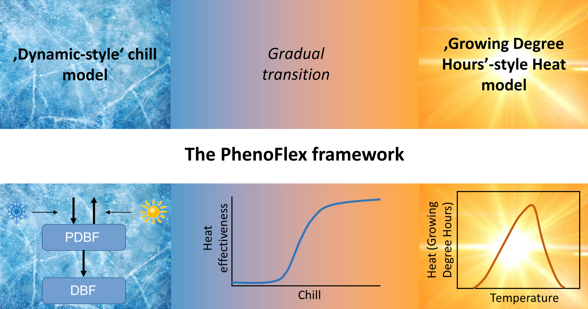

# The `PhenoFlex` model {#phenoflex}

## Learning goals for this lesson {-#goals_phenoflex}

- Get to know the `PhenoFlex` modeling framework
- Learn how to run `PhenoFlex`
- Learn how to parameterize `PhenoFlex` based on spring phenology data

## Ingredients of this lesson

Long-term temperature data for Klein-Altendorf is available for download here again - save this in the `data` folder if it's not there already:

```{r, echo = FALSE}
library(downloadthis)
download_link(
  link = 
    "data/TMaxTMin1958-2019_patched.csv",
  button_label = "Download weather data for Campus Klein Altendorf (1958-2019)",
  button_type = "warning",
  has_icon = TRUE,
  icon = "fa fa-umbrella"
  )
```

The 'Alexander Lucas' pear dataset from Klein-Altendorf, which we'll fit the `PhenoFlex` model for, is available here for download again - save this in the `data` folder if it's not there already:

```{r, echo=FALSE}
download_link(
  link = 
    "data/Alexander_Lucas_bloom_1958_2019.csv",
  button_label = "Download bloom data for Alexander Lucas pears (1958-2019)",
  button_type = "warning",
  has_icon = TRUE,
  icon = "fa fa-leaf"
  )
```

And here's all the code for this lesson as one R script:

```{r, echo=FALSE}
download_link(
  link = 
    "code/chillR_PhenoFlex.R",
  button_label = "R script for this lesson",
  button_type = "warning",
  has_icon = TRUE,
  icon = "fa fa-download"
  )
```


## Towards credible phenology models

So far, all phenology modeling frameworks that I'm aware of are based on the rather broad concepts of chill and heat accumulation (or only heat accumulation), without including much detail on tree physiology. In the long run, a process-based model that incorporates robust biological knowledge on what happens in trees during dormancy would be desirable. We've explored this objective a bit, and we still have it in mind for future model development, but it doesn't seem like such a model is within easy reach at the moment.

Even with the tools that have been used for phenology modeling so far, there is considerable scope for improving phenology models.

As I mentioned a few times already, the Dynamic Model is currently the front-runner among available chill models - but we're not even using it as intended by the developers. This model was produced for peaches grown under experimental conditions in Israel, and the authors explicitly recommended re-calibrating it before use on other species (and possibly in other locations). This has almost never been done. 

I'm not aware of any calls for re-calibrating the most commonly used heat model, the Growing Degree Hours Model, but also there, we really have no good reason to believe that all trees respond in the same way as the peaches in Utah that were used in making this model.

What also remains largely unaddressed in existing phenology modeling frameworks is the possibility that trees can, to some extent, compensate insufficient chill accumulation by additional heat. The 'Overlap model' [@pope2014biologically] does this to some extent, but it has not tackled the two other issues mentioned above.

## The PhenoFlex framework

PhenoFlex [@luedelingPhenoFlex] is a new modeling framework developed in a collaboration between [my working group](http://www.hortibonn.de) and [Prof. Carsten Urbach](https://scholar.google.de/citations?user=M6cyw30AAAAJ&hl=de), from the [Helmholtz-Institut für Strahlen- und Kernphysik](https://www.hiskp.uni-bonn.de/index.php?id=74&L=1). In some way, we tried following the footsteps of [Dr. Amnon Erez'](https://scholar.google.com/citations?user=sh6vJt0AAAAJ&hl=en) group in Israel, where the Dynamic Model was developed. Amnon also found a physicist to collaborate with, [Dr. Svetlana Fishman](https://www.researchgate.net/profile/Svetlana_Fishman), who contributed most of the maths to that project.

Working across disciplines often comes with a lot of explaining of disciplinary basics (in all directions), and it often involves some misunderstandings, but the outcomes can be quite rewarding! We could never have developed the PhenoFlex model on our own, and Carsten would never have thought of applying his skills to such a problem. A classic win-win situation!

So here's what this model includes:



We're making use of the basic structure of the Dynamic Model for chill accumulation and the structure of the Growing Degree Hours concept for forcing. The transition between these two dormancy phases is modeled via a sigmoidal curve that translates accumulated chill into heat effectiveness. Below a certain critical chill accumulation, heat doesn't accumulate at all. Past this threshold, heat gradually gets more effective, until it reaches full effectiveness. 

The source code of the `PhenoFlex` model is now written in C++, because that apparently allows the code to run faster. We can still run it in R, but to actually see the code, we need to look into the C++ source file. We'll skip this here, because things get a bit more technical there than we need to be here. Let's rather look at how this model can be run.

## Running `PhenoFlex`

`chillR` now contains the function `PhenoFlex`. The default parameters in this function allow us to run the model. Of course, we should first find a plausible set of parameters, before we use it for actual phenology predictions. But let's first see how the model can be run. I'll use an hourly temperature dataset derived from our weather data for Klein-Altendorf to demonstrate this.

```{r}
library(chillR)
library(ggplot2)
CKA_weather <- read_tab("data/TMaxTMin1958-2019_patched.csv")
hourtemps <- stack_hourly_temps(CKA_weather, 
                                latitude = 50.6)
```

We'll set a critical chilling requirement `yc` and a heat requirement `zc` and leave all the other parameters as they are in the default model.

The way this model is run is that we first generate a dataset `iSeason` that contains separate data for each season (the `mrange` parameter indicates the start and end months of the season). We can then apply the `PhenoFlex` framework directly, using the temperature column of our dataset. I first selected only the data for a possible season of interest (2009) for clarity.

```{r}
yc <- 40
zc <- 190
iSeason <- genSeason(hourtemps,
                     mrange = c(8, 6),
                     years = c(2009))

season_data <- hourtemps$hourtemps[iSeason[[1]],]

res <- PhenoFlex(temp = season_data$Temp,
                 times = c(1: length(season_data$Temp)),
                 zc = zc,
                 stopatzc = TRUE,
                 yc = yc,
                 basic_output = FALSE)
```

The `res` object now contains a lot of information, including daily values for all the variables that are tracked throughout the season (x, y, z and xs). In this notation, x is the precursor to the dormancy-breaking factor (in the Dynamic Model), y is the dormancy-breaking factor (a.k.a. Chill Portion, in the Dynamic Model), z is heat accumulation (according to the Growing Degree Hours model) and xs is the ratio of the formation to the destruction rate of x (again for the Dynamic Model). Finally, the single number `res$bloomindex` is the date of bloom (or whatever this particular version of the model predicts). This date is given as the number of the hour in the seasonal temperature dataset that corresponds to bloom. We can convert it by typing `season_data$DATE[res$bloomindex]`. In this case, that date is `r season_data$DATE[res$bloomindex]`.

We can look in detail at how the various variables change over time by examining the other output elements, e.g. the accumulation of chill (y) and heat (z) over time:

```{r}
DBreakDay <- res$bloomindex
seasontemps <- hourtemps$hourtemps[iSeason[[1]],]
seasontemps[,"x"] <- res$x
seasontemps[,"y"] <- res$y
seasontemps[,"z"] <- res$z
seasontemps <- add_date(seasontemps)

CR_full <- seasontemps$Date[which(seasontemps$y >= yc)[1]]
Bloom <- seasontemps$Date[which(seasontemps$z >= zc)[1]]

chillplot <- ggplot(data = seasontemps[1:DBreakDay,],
                    aes(x = Date,
                        y = y)) +
  geom_line(col = "blue",
            lwd = 1.5) +
  theme_bw(base_size = 20) +
  geom_hline(yintercept = yc,
             lty = 2,
             col = "blue",
             lwd = 1.2) +
  geom_vline(xintercept = CR_full,
             lty = 3,
             col = "blue",
             lwd = 1.2) +
  ylab("Chill accumulation (y)") +
  labs(title = "Chilling") +
  annotate("text",
           label = "Chill req. (yc)", 
           x = ISOdate(2008,10,01),
           y = yc*1.1,
           col = "blue",
           size = 5)

heatplot <- ggplot(data = seasontemps[1:DBreakDay,],
                   aes(x = Date,
                       y = z)) +
  geom_line(col = "red",
            lwd = 1.5) +
  theme_bw(base_size = 20) +
  scale_y_continuous(position = "right") +
  geom_hline(yintercept = zc,
             lty = 2,
             col = "red",
             lwd = 1.2) +
  geom_vline(xintercept = CR_full,
             lty = 3,
             col = "blue",
             lwd = 1.2) +
  geom_vline(xintercept = Bloom,
             lty = 3,
             col = "red",
             lwd = 1.2) +
  ylab("Heat accumulation (z)") +
  labs(title = "Forcing") +
  annotate("text",
           label = "Heat req. (zc)", 
           x = ISOdate(2008,10,01),
           y = zc*0.95,
           col = "red",
           size = 5)


library(patchwork)
chillplot + heatplot

```

The dotted lines here show the dates of fulfillment for the critical chill requirement (blue) and the heat requirement (red). You can see that heat accumulation (right plot) starts to rise slowly after the critical chill requirement has been fulfilled and only really takes off some time after that. This is partly explained by temperatures being pretty low during this time, but it may also be related to the gradual phasing in of heat effectiveness.

Now let's formulate this as a loop, so we can easily get predictions for multiple seasons. I'll only output the bloom dates now, rather than the full details.

```{r, message=FALSE, warning=FALSE}
yc <- 40
zc <- 190
seasons <- 1959:2019

iSeason <- genSeason(hourtemps,
                     mrange = c(8, 6),
                     years = seasons)
for (sea in 1:length(seasons))
{season_data <- hourtemps$hourtemps[iSeason[[sea]], ]
 res <- PhenoFlex(temp = season_data$Temp,
                  times = c(1: length(season_data$Temp)),
                  zc = zc,
                  stopatzc = TRUE,
                  yc = yc,
                  basic_output = FALSE)
 if(sea == 1)
    results <- season_data$DATE[res$bloomindex] else
      results <- c(results,
                   season_data$DATE[res$bloomindex])}

predictions <- data.frame(Season = seasons,
                          Prediction = results)
predictions$Prediction <-
  ISOdate(2001,
          substr(predictions$Prediction, 4, 5),
          substr(predictions$Prediction, 1, 2))

ggplot(data = predictions,
       aes(x = Season,
           y = Prediction)) +
  geom_smooth() +
  geom_point() +
  ylab("Predicted bloom date") +
  theme_bw(base_size = 15)

```

So now we can use this model, but we still can't adapt it to the particular tree cultivar we're interested in. One of the benefits of the `PhenoFlex` framework is that it can be parameterized with observed phenology data. Well, this feature isn't really unique to `PhenoFlex`, but so far the procedures used to achieve such parameterization have often remained somewhat obscure. Here, we'll show how this can be done.

## Parameterizing `PhenoFlex`

The `PhenoFlex` model has 12 parameters:

- `yc` - chilling requirement; critical value of y, which defines the end of chill accumulation - default value: 40
- `zc` - heat requirement; critical value of z, which defines the end of heat accumulation - default value: 190
- `s1` - slope parameter that determines the transition from the chill accumulation to the heat accumulation period in `PhenoFlex` - default value: 0.5
- `Tu` - optimal temperature of the Growing Degree Hours (GDH) model - default value: 25
- `E0` - time-independent activation energy of forming the PDBF - default value: 3372.8 (as in the widely used version of the Dynamic Model)
- `E1` - time-independent activation energy of destroying the PDBF - default value: 9900.3 (as in the widely used version of the Dynamic Model)
- `A0` - amplitude of the (hypothetical) process involved in forming the precursor to the dormancy-breaking factor in the Dynamic Model - default value: 6319.5 (as in the widely used version of the Dynamic Model)
- `A1` - amplitude of the (hypothetical) process involved in destroying the precursor to the dormancy-breaking factor (PDBF) in the Dynamic Model - default value: 5.939917e+13 (as in the widely used version of the Dynamic Model)
- `Tf` - transition temperature parameter of the sigmoidal function in the Dynamic Model, involved in converting PDBF to Chill Portions - default value: 4
- `Tc` - upper threshold in the GDH model - default value: 36
- `Tb` - base temperature of the GDH model - default value: 4
- `slope` - slope parameter of the sigmoidal function in the Dynamic Model, which determines what fraction of the PDBF is converted to a Chill Portion - default value: 1.6

Fitting a model with so many parameters and with a somewhat complex structure isn't trivial. There is no analytical solution that would allow us to unambiguously compute the 'correct' values.

In such situations, we can use empirical solving procedures to determine suitable parameter sets. I'm not a big expert on such solvers, but let me tell you how I understand them. Basically, you start with a set of initial estimates for all parameters. You can also set plausible ranges for all the parameters that the final solution should be within. The solver then uses these initial parameters to predict outcomes. Based on the errors it encounters, it then adjusts these parameters in certain ways until it identifies a parameter set that delivers predictions with reasonable accuracy.

In using solvers, we usually can't be sure that we've actually found the ideal parameter set, because there are many paths the solver can take through the parameter space, and there may be multiple points where the residuals (the prediction errors) reach local minima. This is why it is common to run a solver multiple times with differing sets of initial values, which can sometimes lead to rather different results.

Compared to a simple regression model, this process may seem a bit messy, but such empirical procedures are very commonly applied in many fields of science.

The solving process we use within `chillR` is called [Simulated Annealing](https://en.wikipedia.org/wiki/Simulated_annealing). If you're mathematically inclined, check out the Wikipedia link. It's a pretty cool procedure that's commonly used for similar challenges.

We'll use our Alexander Lucas dataset to fit the `PhenoFlex` model. 

```{r}
Alex_first <-
  read_tab("data/Alexander_Lucas_bloom_1958_2019.csv") %>%
  select(Pheno_year, First_bloom) %>%
  mutate(Year = as.numeric(substr(First_bloom, 1, 4)),
         Month = as.numeric(substr(First_bloom, 5, 6)),
         Day = as.numeric(substr(First_bloom, 7, 8))) %>%
  make_JDay() %>%
  select(Pheno_year, JDay) %>%
  rename(Year = Pheno_year,
         pheno = JDay)

hourtemps <- 
  read_tab("data/TMaxTMin1958-2019_patched.csv") %>%
  stack_hourly_temps(latitude = 50.6)
```

We need to start the model with a set of initial parameters, as well as lower and upper bounds for all parameters. Most of these are quite difficult to fit in this case, because they don't correspond to a real-life process we can easily make estimates for. The Dynamic Model in particular contains parameters for the activation energies and amplitudes of two temperature-dependent processes that produce and destroy the precursor to chill. These considerations are based on a hypothetical process whose nature we don't understand. This makes it pretty hard to come up with reasonable numbers here. The job isn't made much easier by looking at previous estimates, which feature a wide range of values for these parameters.

I currently don't have very good guidance for estimating many of the values. Other parameters, such as the sensitive temperatures in the Growing Degree Hours model, can be estimated with greater confidence of course. Hopefully, we'll come up with a parameter selection strategy at some point. In the meantime, let's use this set:

```{r}

# here's the order of the parameters (from the helpfile of the
# PhenoFlex_GDHwrapper function)
#          yc,  zc,  s1, Tu,    E0,      E1,     A0,         A1,   Tf, Tc, Tb,  slope
par <-   c(40, 190, 0.5, 25, 3372.8,  9900.3, 6319.5,
           5.939917e13,  4, 36,  4,  1.60)
upper <- c(41, 200, 1.0, 30, 4000.0, 10000.0, 7000.0,  
           6.e13, 10, 40, 10, 50.00)
lower <- c(38, 180, 0.1, 0 , 3000.0,  9000.0, 6000.0,   
           5.e13,  0,  0,  0,  0.05)

```

To run the fitting procedure, we have to first generate a list of seasons and then feed this into the actual fitter function `phenologyFitter`. Note that the model function in the fitter isn't `PhenoFlex` itself, but a wrapper function that just requires the arguments `x` (the temperature data) and `par`, which contains the whole set of parameters. This format is needed to run the fitter.

Running such a solver can take a long time, because the algorithm should run through 1000 or more iterations before settling on the final parameter set. This is controlled with the `maxit` parameter. I've run the procedure with 1000 iterations and saved the parameters, so I don't have to do it again now. If you want to use the resulting parameter set for some real purpose, I'd recommend investing the time to wait for the results. If you're just doing this for the fun of it, you can reduce `maxit`, maybe to 100.

```{r, eval=FALSE}

SeasonList <- genSeasonList(hourtemps$hourtemps,
                            mrange = c(8, 6),
                            years = c(1959:2019))

Fit_res <- 
  phenologyFitter(par.guess = par, 
                  modelfn = PhenoFlex_GDHwrapper,
                  bloomJDays = Alex_first$pheno[which(Alex_first$Year > 1958)],
                  SeasonList = SeasonList,
                  lower = lower,
                           upper = upper,
                           control = list(smooth = FALSE,
                                          verbose = FALSE, 
                                          maxit = 1000,
                                          nb.stop.improvement = 5))

Alex_par <- Fit_res$par

write.csv(Alex_par,
          "data/PhenoFlex_parameters_Alexander_Lucas.csv")


```

Now we may want to visualize model quality. I only saved the model parameters so far (and I don't want to repeat these 1000 iterations), so we may have to reproduce the predictions for this. I'll then calculate the RMSEP, the mean error and the mean absolute error, which are useful measures of model accuracy, and I'll make a couple of plots.

```{r, warning=FALSE,message=FALSE}
Alex_par <- 
  read_tab("data/PhenoFlex_parameters_Alexander_Lucas.csv")[,2]

SeasonList <- genSeasonList(hourtemps$hourtemps, 
                            mrange = c(8, 6),
                            years = c(1959:2019))

Alex_PhenoFlex_predictions <- Alex_first[which(Alex_first$Year > 1958),]

for(y in 1:length(Alex_PhenoFlex_predictions$Year))
   Alex_PhenoFlex_predictions$predicted[y] <-
    PhenoFlex_GDHwrapper(SeasonList[[y]],
                         Alex_par)

Alex_PhenoFlex_predictions$Error <- 
  Alex_PhenoFlex_predictions$predicted - 
  Alex_PhenoFlex_predictions$pheno

RMSEP(Alex_PhenoFlex_predictions$predicted,
      Alex_PhenoFlex_predictions$pheno)

mean(Alex_PhenoFlex_predictions$Error)

mean(abs(Alex_PhenoFlex_predictions$Error))

ggplot(Alex_PhenoFlex_predictions,
       aes(x = pheno,
           y = predicted)) +
  geom_point() +
  geom_abline(intercept = 0,
              slope = 1) +
  theme_bw(base_size = 15) +
  xlab("Observed bloom date (Day of the year)") +
  ylab("Predicted bloom date (Day of the year)") +
  ggtitle("Predicted vs. observed bloom dates")

ggplot(Alex_PhenoFlex_predictions,
       aes(Error)) +
  geom_histogram() +
  ggtitle("Distribution of prediction errors")

```

The mean error of the predictions is `r round(mean(Alex_PhenoFlex_predictions$Error),2)`, the mean absolute error is `r round(mean(abs(Alex_PhenoFlex_predictions$Error)),1)` and the RMSEP is `r round(RMSEP(Alex_PhenoFlex_predictions$predicted,Alex_PhenoFlex_predictions$pheno),1)`. All of these are very low, indicating very good performance of the `PhenoFlex` model.

Strictly speaking, we should not validate model performance in this way. We should be using a certain set of observations to calibrate the model and another set to validate it. Ideally, we'd find a set of observations that allow us to *validate for purpose*, i.e., for a climate change study, under particularly warm conditions. We're not going to do this here, but note that this should ideally be done.

I'll admit here that in running the solver, I didn't allow for a lot of flexibility in terms of the Dynamic Model parameters. This constrained the temperature response during endodormancy to a shape that is relatively close to that in the the original version of the model. Allowing for much more wiggle room there can lead to quite unrealistic results that do not seem plausible. As I mentioned before, deciding on the right set of initial values and setting appropriate boundaries for the model parameters can be critical, but I don't currently have a lot of good advice on how to select all these values.

We should also now estimate the errors that are involved in our predictions. This can be achieved with the `bootstrap.phenologyFit` function in `chillR`. If you want to learn more about this, please refer to the [`chillR` vignette on the `PhenoFlex` model](https://cran.r-project.org/web/packages/chillR/vignettes/PhenoFlex.html).

## Conclusions on `PhenoFlex`

The `PhenoFlex` framework performed quite convincingly in predicting bloom dates of 'Alexander Lucas' pears in Klein-Altendorf. Observed bloom dates were reproduced quite reliably, with prediction errors more or less normally distributed. Prediction errors were homogeneously distributed across the whole spectrum of bloom dates, indicating that the model is equally reliable in predicting early bloom dates as in predicting late flowering.

These characteristics bode well for use of this modeling framework to predict phenology even under future temperature conditions. All the considerations about *validity domains* etc. still hold, but I'd be a lot more confident in this model than in most previous prediction attempts, where models often did not perform as well, and also fell short of incorporating the state of knowledge on temperature responses during dormancy.


## `Exercises` on the `PhenoFlex` model {-#ex_model_phenoflex}

Please document all results of the following assignments in your `learning logbook`.

1) Parameterize the `PhenoFlex` model for `Roter Boskoop' apples.
2) Produce plots of predicted vs. observed bloom dates and distribution of prediction errors.
3) Compute the model performance metrics RMSEP, mean error and mean absolute error.

